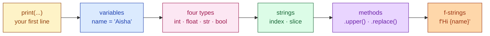
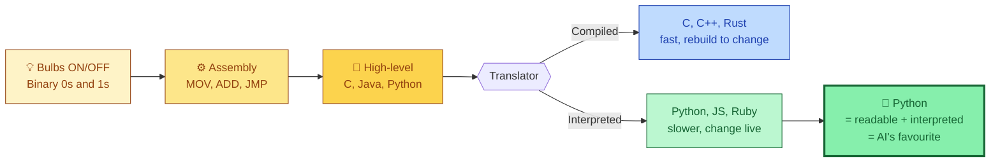

# Session 1.1 — Live Class

> **Module 1:** Python Programming Fundamentals and Flow Control
> **Title:** Introduction to Python and String Manipulation

---

## 🗺️ Today's journey



We'll move left to right. Each block builds on the one before — look back here any time to see where we are.

---

## How computers actually work

Imagine 8 light bulbs in a row, like a string of fairy lights. Each bulb has only two states — **ON or OFF**. There is no 'kinda on'. No 'half-bright'. ON or OFF.

Write 8 letters under those bulbs:

```
Bulbs:   💡  🌑  💡  💡  🌑  🌑  💡  🌑
State:    1   0   1   1   0   0   1   0
```

That's the number **178** in binary. The whole computer is just a *lot* of these bulbs flipping very fast — billions of times per second. The transistors inside your phone are exactly this. ON. OFF. ON. OFF.

When you tap your screen and send a WhatsApp 'hi', that 'hi' eventually becomes 0s and 1s. Letter `h` is `01101000`. Letter `i` is `01101001`. Your phone sees only that. The picture of the heart you sent? Millions of 0s and 1s. The reel you watched? Same.

> **A computer is a very fast bulb-flipper.**
> **Everything else — every app, every game, every AI — is built on top of that one trick.**

---

## Why Assembly came first

Writing programs by literally setting bulbs ON and OFF is brutally error-prone. One wrong bulb and your program does something completely different. So humans got smart.

Imagine you're a head chef in a busy restaurant. You want your kitchen staff to make a dosa. Two options:

**Option A — write to them in raw 0s and 1s:**
```
01001101 01001111 01010110 ...
```
Have fun debugging that on a Friday night.

**Option B — write a kitchen prep ticket:**
```
MOV   batter, tawa
ADD   oil 1tsp
WAIT  60
FLIP  dosa
```

**This is Assembly Language.** It's still very low-level. Every instruction (`MOV`, `ADD`, `WAIT`) is one tiny step the CPU does. But at least you can *read* it. At least you can *change* it without recounting bulbs.

```asm
; Add two numbers in Assembly
MOV  AX, 5      ; put 5 in box AX
ADD  AX, 3      ; add 3 to box AX
                ; AX now holds 8
```

Each line gets translated by a tool called an **assembler** into the right pattern of 0s and 1s. We went from *flipping bulbs* to *writing tickets*. Massive progress.

But each line still does *one tiny thing*. To draw a single button you'd write thousands of lines. Nobody would build Instagram in Assembly.

> **Assembly = readable for humans, still close to the machine, but painfully verbose.**

---

## High-level languages

In the 1950s and 60s, language after language appeared:

| Year | Language | Big Idea |
|------|----------|----------|
| 1957 | FORTRAN | First language for scientists |
| 1972 | C | Closer to hardware, very fast |
| 1985 | C++ | C + objects, used in games and browsers |
| 1995 | Java | "Write once, run anywhere" |
| 1995 | JavaScript | The language of the web |
| 1991 | **Python** | Designed to be **readable like English** |



Four levels of abstraction in 70 years. At the top: **Python** — the language we'll write in for the rest of this program.

These are called **high-level languages**. They are *far* from the bulbs. You write something like:

```python
x = 5 + 3
print(x)
```

The computer doesn't directly understand this — but a translator does. The translator takes your English-ish code and turns it back into Assembly, then into bulbs. **You** stop worrying about bulbs.

> **A high-level language is just an English-ish recipe. The translator turns it into the kitchen ticket.**

---

## Compiled vs interpreted

There are *two kinds* of translators — and the difference is why Python is special.

Imagine your dadi wrote you a recipe book in Hindi. You only speak English. Two ways to handle this:

**Strategy 1 — Compiled:** Translate the **entire book** to English once. Print it out. Cook from the printed English copy whenever you want. Fast cooking. But if dadi changes the recipe, you have to translate and reprint *the whole book* again.

**Strategy 2 — Interpreted:** Hire a translator who stands next to you in the kitchen. As you read each Hindi line, she translates it on the spot. Slightly slower per line — but if you change the recipe mid-cook, no problem, she just translates the new line.

| | Compiled | Interpreted |
|---|---|---|
| Translates | All at once, before running | Line by line, while running |
| Speed at runtime | Very fast | Slightly slower |
| Easy to change & re-run? | No, must rebuild | Yes, instantly |
| Examples | C, C++, Rust, Go | **Python**, JavaScript, Ruby |

**Python is interpreted.** That means when you change one line and re-run, you see the result *immediately*. No 'building'. No 'compiling'. This makes Python the perfect language to **experiment** with — which is exactly what AI/ML engineers do all day. They try things. They tweak. They try again.

> **Python = English-ish + Interpreted = fast to learn, fast to experiment with.**

---

## Python — and why AI loves it

Created by **Guido van Rossum** in 1991. He named it after *Monty Python's Flying Circus* — not the snake.

**Reads like English.** Compare:

```c
// C — about 10 lines to print a list
#include <stdio.h>
int main() {
    char* names[] = {"Aisha", "Ravi", "Priya"};
    for (int i = 0; i < 3; i++) {
        printf("%s\n", names[i]);
    }
    return 0;
}
```

```python
# Python — 2 lines
for name in ["Aisha", "Ravi", "Priya"]:
    print(name)
```

Same job. Python is dramatically less ceremony.

### Why AI/ML chose Python

1. **Readable** — researchers care about ideas, not syntax.
2. **Interpreted** — try, fail, fix instantly.
3. **The libraries.** Every major AI tool — **TensorFlow, PyTorch, scikit-learn, pandas, NumPy, LangChain, OpenAI's SDK** — has a Python interface first. Other languages get a port months later, if at all.
4. **Free, open-source, runs everywhere** — including in a browser tab via **Google Colab**, which we're about to use.

> **Python is the lingua franca of AI. If you know Python, you can talk to every AI tool ever built.**

---

## Your first Python program (Colab)

Open https://colab.research.google.com and sign in with your Google account.

1. Click **File → New notebook**. A new tab opens.
2. **Rename** the notebook (top-left, click the title): `s1-1-first-class.ipynb`
3. You'll see a grey box. That's a **cell** — where we write code.
4. Click inside the cell. Type:

   ```python
   print("Hello, World")
   ```

5. Press **Shift + Enter**.
6. Below the cell, you should see `Hello, World` appear.

`print()` is Python's way of saying *show this on screen*. The thing in the brackets is what gets shown. The text in quotes — `"Hello, World"` — is called a **string**. We'll spend the second half of class on strings.

### Add another cell

Click **+ Code** at the top. Try this:

```python
print(2 + 3)
print("AI is ", "powered by Python")
```

Python can also do math. `2 + 3` shows `5`. And we can print multiple things separated by commas.

### Common Colab moves

- **Shift + Enter** — run the current cell, move to the next.
- **Ctrl/Cmd + Enter** — run the current cell, stay in it.
- **+ Code** — add a code cell. **+ Text** — add a markdown cell (for notes).
- The little number `[1]` next to a cell shows the order in which cells ran.

---

## Variables — labels for values

To remember a value, we need to give it a **name**.

```python
age = 21
print(age)
```

Three ideas in one line:

1. **`age`** is a name we made up.
2. **`=`** is *not* "equals" like in math. In Python it means **'put the thing on the right into the box on the left'**. We say "**assign**".
3. After this line runs, `age` *is* `21` until we change it.

### The tiffin-box analogy

Imagine a row of empty tiffin boxes. When you write `age = 21`, you take a sticker, write `age` on it, slap it on a box, and put `21` inside.

```
  ┌─────────┐
  │   21    │   ← value
  └─────────┘
       ↑
     [age]    ← label/name
```

The box can be **rewritten**:

```python
age = 21
print(age)        # 21

age = 22          # birthday!
print(age)        # 22
```

Same box. New value. The label `age` always points to whatever's currently inside.

> 🛠️ **Watch it happen:** open [Python Tutor](https://pythontutor.com/visualize.html#mode=edit), paste a few `age = 21; age = 22` lines, hit "Visualize Execution" and step through. You'll *see* the box label move from `21` to `22`.

### Naming rules

- ✅ Letters, digits, underscores: `name`, `user_age`, `score2`
- ❌ Cannot start with a digit: `2name` is invalid
- ❌ No spaces: write `first_name`, not `first name`
- ❌ Avoid Python's reserved words (`print`, `if`, `for`, …)
- 💡 **Snake case is the convention**: `first_name`, not `firstName` or `FirstName`
- 💡 **Use meaningful names.** `x = 21` works, but `age = 21` tells the next reader what you mean.

---

## The four basic types

Phone numbers, names, prices, on/off settings — Python sorts values into **types**.

| Type | What it is | Example |
|------|------------|---------|
| `int` | whole number | `21`, `-5`, `0`, `1000000` |
| `float` | decimal number | `3.14`, `99.99`, `-0.5` |
| `str` | text (a string) | `"Aisha"`, `"hello"`, `"42"` |
| `bool` | yes/no, true/false | `True`, `False` |

```python
age = 21               # int — whole number
height = 5.7           # float — has a decimal point
name = "Aisha"         # str — text in quotes
is_student = True      # bool — capital T

print(age, height, name, is_student)
```

### A quick aside — int arithmetic beyond `+ - * /`

```python
print(10 // 3)    # 3   — floor division (drops decimal)
print(10 % 3)     # 1   — modulo (remainder)
print(2 ** 8)     # 256 — power (2 to the 8th)
```

Don't memorise — just know they exist when you see them.

### ⚠️ The floating-point surprise

```python
print(0.1 + 0.2)     # 0.30000000000000004  — not exactly 0.3!
```

**Computers store decimals in binary, and some decimals can't be represented exactly** — like how `1/3` in our decimal system is `0.333…` forever. This catches every beginner once. We'll work around it later with `round()`. For now, just don't be surprised.

### `type()` — ask Python what it is

```python
print(type(age))         # <class 'int'>
print(type(height))      # <class 'float'>
print(type(name))        # <class 'str'>
print(type(is_student))  # <class 'bool'>
```

### Common confusions

**1. `"42"` is not `42`.**

```python
a = 42
b = "42"

print(type(a))   # int
print(type(b))   # str

print(a + 1)     # 43
print(b + 1)     # ❌ ERROR — can't add a number to a string
```

Quotes change *everything*. With quotes, it's text. Without, it's a number.

**2. `True` and `False` must be capitalized.**

```python
done = True       # ✅
done = true       # ❌ NameError
```

**3. Converting between types.**

```python
age_str = "21"
age_int = int(age_str)   # convert "21" to 21
print(age_int + 1)       # 22

price = 99.99
print(int(price))        # 99 — chops the decimal off

print(str(age_int))      # "21" — number to string
```

`int()`, `float()`, `str()`, `bool()` are tools that *convert* a value from one type to another.

**…but conversion can fail:**

```python
int("hello")     # ❌ ValueError: invalid literal for int()
int("3.14")      # ❌ ValueError — int() won't parse a float string
float("3.14")    # ✅ 3.14   — float() is more forgiving
int(float("3.14"))   # ✅ 3   — convert in two steps
```

**`int()` only works on strings that look like whole numbers.** If there's a decimal point or letters, it crashes. `float()` is more forgiving — it'll happily parse `'3.14'`. Remember this when you start cleaning real-world form data.

### Same symbol `+`, different meaning

```python
x = 10
y = "10"
print(x + x)   # 20   — number + number
print(y + y)   # 1010 — Python "glues" two strings together
```

Same `+`, different behaviour depending on type. This is critical.

### One more thing about booleans

In real code, **booleans almost always come from a comparison**:

```python
score = 75
print(score >= 60)        # True
print(score == 100)       # False
print(score != 50)        # True
```

`>=`, `==`, `!=`, `<`, `>`, `<=` — every one of these returns a boolean. Hold this thought; we'll use it heavily in Session 2.2 when we learn `if` statements.

---

## Strings — quotes, indexing, slicing

Strings are the most interesting type for AI: every chat message, every prompt, every document an AI reads — is a string.

### Quotes — three ways

```python
a = 'hello'
b = "hello"
c = """hello"""
print(a == b == c)   # True — all the same
```

Single, double, triple quotes — Python doesn't mind. Switch when one is inside the other:

```python
quote = "She said, 'hi'"     # double outside, single inside
quote = 'It\'s fine'         # or escape with backslash
```

Triple quotes are useful for **multi-line** strings:

```python
poem = """Roses are red
Violets are blue
Python is fun
And so are you"""
print(poem)
```

### Concatenation — gluing strings together

```python
first = "Aisha"
last = "Khan"
full = first + " " + last
print(full)           # Aisha Khan
```

The `+` glues strings. Don't forget the space — Python won't add it for you.

### Repeating strings — the `*` operator

```python
print("ha" * 3)          # hahaha
print("-" * 30)          # ------------------------------ (handy for separators)
```

### `len()` — how long is the string?

```python
name = "Aisha"
print(len(name))         # 5

empty = ""
print(len(empty))        # 0
```

### Indexing — the bead necklace

A string is a bead necklace. Every bead has a position number. **Python starts counting at 0, not 1.** This trips up everyone — including instructors, on Day 1.

```
String:   A   I   S   H   A
Index:    0   1   2   3   4
```

```python
name = "AISHA"
print(name[0])    # A
print(name[1])    # I
print(name[4])    # A
print(name[5])    # ❌ IndexError — there is no bead 5
```

### Negative indexing — counting from the end

```
String:   A   I   S   H   A
Index:    0   1   2   3   4
Neg:     -5  -4  -3  -2  -1
```

```python
name = "AISHA"
print(name[-1])    # A — last character
print(name[-2])    # H — second from end
```

`name[-1]` is the last character without you having to know the length.

### Slicing — picking a section of beads

Syntax: `name[start:stop]` — gives you everything from `start` *up to but not including* `stop`.

```python
word = "PYTHON"
#         0 1 2 3 4 5

print(word[0:3])    # PYT — positions 0, 1, 2
print(word[2:5])    # THO — positions 2, 3, 4
print(word[:3])     # PYT — start defaults to 0
print(word[3:])     # HON — stop defaults to end
print(word[:])      # PYTHON — full copy
print(word[-3:])    # HON — last three characters
```

Three things to remember:

1. **Stop is exclusive** — `word[0:3]` does not include position 3.
2. **Empty start** = from beginning. **Empty stop** = until the end.
3. **Negative slicing works too** — great for "the last N characters".

---

## String methods — your daily tools

A method is a verb attached to a noun. The noun is the string. The verb is what you want done to it.

Syntax: `name.method()` — read it as **`name`, do this thing**.

### The essential six

```python
name = "  Aisha Khan  "

print(name.upper())              # "  AISHA KHAN  "
print(name.lower())              # "  aisha khan  "
print(name.strip())              # "Aisha Khan"  — removes outer whitespace
print(name.replace("Aisha","Priya"))   # "  Priya Khan  "
print(name.find("Khan"))         # 8 — index where 'Khan' starts
print(name.split(" "))           # ['', '', 'Aisha', 'Khan', '', '']
```

Methods **don't change the original string**. They give you back a **new** string. To keep the change, assign it:

```python
name = "  Aisha Khan  "
name = name.strip()        # now name is "Aisha Khan"
print(name)
```

### Real-life — cleaning user input

```python
raw = "   AISHA@gmail.COM "
clean = raw.strip().lower()
print(clean)              # "aisha@gmail.com"
```

Two methods chained together. Strip the spaces, then lowercase. This is real-world AI/ML work — almost every text dataset starts dirty and you clean it like this.

### Method chaining is allowed

```python
print("  Hello World  ".strip().upper().replace("WORLD", "PYTHON"))
# HELLO PYTHON
```

### `.join()` — the inverse of `.split()`

If `split` breaks a string into parts, `join` does the opposite — it glues a list of strings back into one.

```python
parts = ["Aisha", "Khan"]
print(" ".join(parts))     # "Aisha Khan"        — glue with a space
print(", ".join(parts))    # "Aisha, Khan"       — glue with a comma+space
print("".join(parts))      # "AishaKhan"         — glue with nothing
```

Read it as: *"using this string as the glue, join these pieces"*. We'll use this constantly once we get to lists in Session 1.2.

### Useful checking methods

```python
"42".isdigit()        # True — all digits?
"Aisha".isalpha()     # True — all letters?
"hello".startswith("he")    # True
"hello.py".endswith(".py")  # True
```

These are most useful as a **guard** before type conversion — check first, convert only if safe:

```python
user_input = "25"
if user_input.isdigit():
    age = int(user_input)     # safe — we already know it's all digits
    print(age + 1)            # 26
```

Don't worry about `if` yet — we'll do that properly in Session 2.2. Just notice the pattern: **check, then convert**. Stops `int()` from crashing on bad input.

---

## f-strings — the modern way

The old way (works, but ugly):

```python
name = "Aisha"
age = 21
greeting = "Hi " + name + ", you are " + str(age) + " years old"
print(greeting)
```

Lots of `+`. And we had to wrap `age` in `str()` because you can't `+` a number with a string.

### The modern way — f-strings

```python
name = "Aisha"
age = 21
greeting = f"Hi {name}, you are {age} years old"
print(greeting)
```

Two new things:

1. **`f` before the opening quote.** This tells Python: *this is a formatted string*.
2. **`{ }` placeholders.** Anything inside curly braces gets evaluated and inserted.

### You can put expressions inside `{ }`

```python
price = 199
quantity = 3
print(f"Total: ₹{price * quantity}")     # Total: ₹597
print(f"Half: {price / 2}")              # Half: 99.5
print(f"Name in caps: {name.upper()}")   # Name in caps: AISHA
```

### Format specifiers — quick mention

```python
pi = 3.14159265
print(f"Pi to 2 decimals: {pi:.2f}")     # Pi to 2 decimals: 3.14
print(f"Padded: {42:05d}")               # Padded: 00042
```

> **f-strings are how modern Python developers build strings. Use them as your default.**

---

## In-class practice

Three quick problems. Try first — solutions are in the post-class README.

### Problem 1 — Personalised greeting

Given:

```python
name = "Ravi"
age = 19
```

Print: *"Hi Ravi, you are 19 years old. Welcome to Python!"*

### Problem 2 — Email cleaner

Given a messy email — `"   STUDENT@IIT.AC.IN  "` — clean it: remove spaces, make lowercase. Print the clean version and its length.

### Problem 3 — Initials

Given a full name — `"Aisha Mehta"` — print just the initials in upper case: `A.M.`

> 💡 **Hint:** use `split(" ")` to break into parts, then `[0]` of each, then an f-string.

If problem 3 felt hard — that's the point. We just combined **split + indexing + f-string**. By Session 1.2 you'll do this in your sleep.

---

## Topics covered

Boxes get ticked as we work through them in the live class.

- [ ] Python
- [ ] Google Colab
- [ ] Basic Data Types
- [ ] Variables
- [ ] Type conversion (int, float, str) and common errors
- [ ] String manipulation
- [ ] String methods including `.strip()`, `.split()`, `.replace()`, `.join()`, `.find()`

## Learning outcomes

By the end of this session you will have demonstrated:

- [ ] Initializing the Python environment
- [ ] Implementing basic data types and variables
- [ ] Executing string manipulation techniques

---

## Code from this session

This folder will hold the `.py` files we built together during the live class. **Files appear here AFTER the lecture is pushed** to GitHub.

If you're seeing this folder before class — that's expected. Bring your laptop; we'll build everything from scratch together. The reference copy gets pushed here so you have a clean version for revision.
