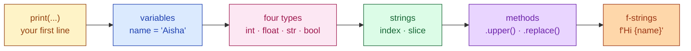

# Session 1.1 — Pre-Class Notes


> **Read this before the live class.**

---

## What you'll do in class

- Run your first Python program (in the browser, no install)
- Store values in **variables**
- Use the four basic **data types** — `int`, `float`, `str`, `bool`
- Manipulate **strings** like a developer (slicing, methods, f-strings)

### 🗺️ Today's journey



<details>
<summary>👀 <b>30-second sneak peek</b> — click to see what these will look like in code</summary>

```python
# Variables — labels for values
name = "Aisha"
age = 21

# Types — Python figures these out for you
print(type(name))   # <class 'str'>
print(type(age))    # <class 'int'>

# Indexing — pick one character by position
print(name[0])      # A   ← first letter
print(name[-1])     # a   ← last letter

# f-string — drop variables straight into text
print(f"Hi {name}, you are {age}!")
# → Hi Aisha, you are 21!
```

Don't try to memorise this — just notice the *shape*. We'll build each piece together.

</details>

---

## Two questions to think about

Don't search for answers — bring your **guesses** to class.

1. A computer chip has no eyes, no ears, no understanding of English. So… *how* does it know what to do when you press a key?
2. ChatGPT, self-driving cars, Instagram filters — all built using Python. **What's so special about this one language?**

---

## Set up Colab (please do this before class)

You need: a **Google account** + a **modern browser**. That's it. To confirm everything works:

1. Open **https://colab.research.google.com**
2. Sign in → **File → New notebook**
3. In the cell, type `print("I am ready for class")` and press **Shift + Enter**
4. If you see the words appear below — you're set.

Stuck? Bring it to class. We'll sort it out at the start.

---

## Mindset (read twice)

- **Programming is a skill, not a talent.** Practice is all there is.
- **Confusion is the job.** If you're not confused at some point, you're not learning.
- **There are no stupid questions.** The student who asks "wait, what's a variable?" in week 1 will be a better engineer in month 6.

---

See you in class 🚀 — bring a charged laptop, your two guesses, and curiosity.

---

<details>
<summary>🎨 <b>Why Python?</b> — click for the famous comic</summary>


*xkcd #353 by Randall Munroe — [licensed CC BY-NC 2.5](https://creativecommons.org/licenses/by-nc/2.5/). The joke captures something real: when Python users say "I learned it last night" — that's actually how it feels. We'll get you flying too.*

</details>
