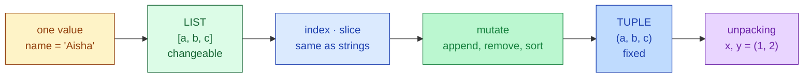
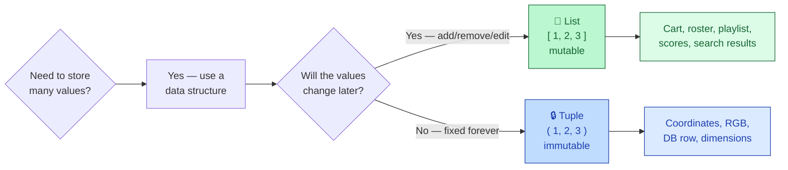
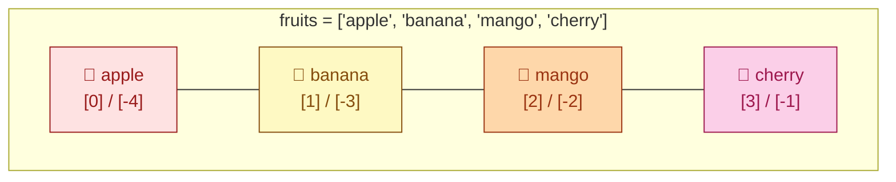
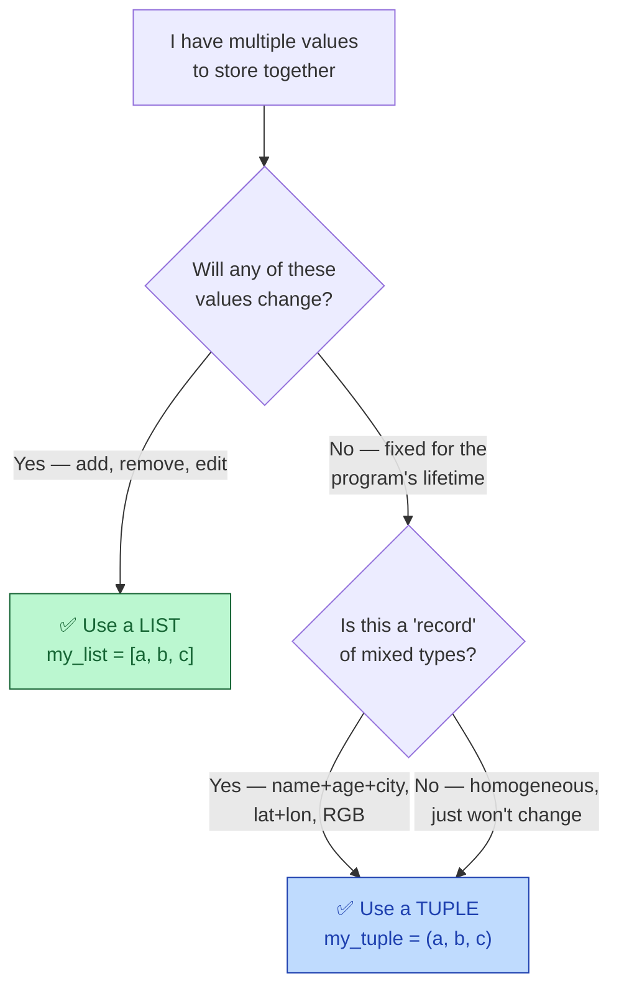

# Session 1.2 — Live Class

> **Module 1:** Python Programming Fundamentals and Flow Control
> **Title:** Core Python Data Structures — Lists & Tuples

---

## 🗺️ Today's journey



We'll move left to right. Each block builds on the one before — look back here any time to see where we are.

---

## Why we need a basket

Last class, you learned to store **one value** in a variable: `age = 21`, `name = "Aisha"`. Now imagine I ask you: store the names of all 60 students in this batch.

With what you know so far, you'd write:

```python
student1 = "Aarav"
student2 = "Priya"
student3 = "Ravi"
# … 57 more lines …
```

Sixty separate variables. To print them all? Sixty `print()` calls. A new student joins? Manually create `student61`. This doesn't scale.

Imagine grocery shopping. You could try to hold milk, eggs, bread, butter in your bare hands. Works for 3 items. At 30, your arms give up. So what do you do? You grab a **basket**. Now your basket holds everything; you carry one thing instead of thirty.

> **A data structure is the basket. One container. Many values.**

### Three superpowers a basket gives you

1. **Store any number of items in one place** — one container holds 100 items, no extra typing.
2. **Process them all together** — search, sort, filter all 100 with the same code.
3. **Map naturally to real-world data** — a shopping cart, a leaderboard, a class roster — these *are* collections.

### Today's two baskets

Python gives you several built-in containers. Today we learn the two most important: **lists** and **tuples**. They look almost identical, but the difference between them is one of the first big choices you make as a programmer.

```
Lists  →  [ ]   →  changeable  →  whiteboard
Tuples →  ( )   →  fixed       →  printed certificate
```



---

## Lists — creation, indexing, slicing

Lists are the workhorse of Python. You'll use them almost every day.

### Creating a list

```python
fruits = ["apple", "banana", "mango", "cherry"]
scores = [88, 72, 95, 60]
mixed  = ["Aisha", 21, True, 9.1]    # any mix of types is fine
empty  = []                           # empty list — perfectly valid
```

Three things to notice:

1. **Square brackets** `[ ]` — that's the list signature.
2. **Comma-separated** items inside.
3. Lists can hold **any type, even mixed**. Strings, numbers, booleans — all in the same basket.

### The train-cars analogy

Think of a list like a train. Each coach holds one passenger (item). Each coach has a fixed seat number — the **index**. Trains can add coaches, drop coaches, or swap passengers — they're flexible.

```
fruits = [ "apple", "banana", "mango", "cherry" ]
index →    0         1         2         3
neg  →    -4        -3        -2        -1
```



Every coach has **two ticket numbers** — positive (counting from the front) and negative (counting from the back). `fruits[2]` and `fruits[-2]` both get you `mango`.

### Indexing — accessing one item

```python
fruits = ["apple", "banana", "mango", "cherry"]

print(fruits[0])     # apple   — first
print(fruits[2])     # mango   — third
print(fruits[-1])    # cherry  — last (negative counts from end)
print(fruits[-2])    # mango   — second from last
```

Same indexing rules as strings from 1.1. Zero-based, negatives count from the end.

### Common mistake — `IndexError`

```python
print(fruits[4])     # ❌ IndexError: list index out of range
```

Valid indices for a 4-item list are `0, 1, 2, 3`. Asking for index `4` is asking for a coach that doesn't exist.

### Slicing — picking a range

Same syntax as strings: `list[start:stop:step]`. **Stop is exclusive** — the item at `stop` is NOT included.

```python
scores = [88, 72, 95, 60, 83]
#  index:  0   1   2   3   4

print(scores[1:4])    # [72, 95, 60]      — indices 1, 2, 3
print(scores[:3])     # [88, 72, 95]      — start to index 3
print(scores[2:])     # [95, 60, 83]      — index 2 to end
print(scores[::2])    # [88, 95, 83]      — every other item
print(scores[::-1])   # [83, 60, 95, 72, 88]   — reversed!
```

> 💡 **Mental model:** Think of indices as **fences between items**, not the items themselves. `scores[1:4]` means "everything between fence 1 and fence 4". This is why `stop` is exclusive.

---

## Lists — adding, changing, removing

We can read from a list. Now — and this is what makes lists special — we can **change** them.

### Replace by index

```python
students = ["Aarav", "Priya", "Ravi"]

students[1] = "Divya"
print(students)    # ['Aarav', 'Divya', 'Ravi']
```

We just **changed** the list in place. Strings can't do this — strings are *immutable*. Lists are **mutable**.

> 🛠️ **Watch it happen:** Open [Python Tutor](https://pythontutor.com/visualize.html#mode=edit), paste a few `students[1] = "Divya"; students.append("Sneha")` lines, hit "Visualize Execution" and step through. You'll *see* the boxes shift, items appear, items vanish.

### Adding items — `.append()` and `.insert()`

```python
students = ["Aarav", "Priya"]

students.append("Ravi")            # adds to the END
print(students)                    # ['Aarav', 'Priya', 'Ravi']

students.insert(1, "Sneha")        # inserts AT index 1, shifts others right
print(students)                    # ['Aarav', 'Sneha', 'Priya', 'Ravi']
```

- **`.append(item)`** — add to the end.
- **`.insert(index, item)`** — squeeze in at a specific position. The other items politely shift over.

### ⚠️ The `.append()` vs `.extend()` trap

```python
a = [1, 2, 3]
a.append([4, 5])
print(a)          # [1, 2, 3, [4, 5]]   ← the WHOLE list became one nested item

b = [1, 2, 3]
b.extend([4, 5])
print(b)          # [1, 2, 3, 4, 5]     ← items added separately
```

If you want to add **multiple items at once**, use `.extend()` — not `.append()`. `append` always adds **one** thing, even if that thing is itself a list.

### Removing items — three ways

```python
fruits = ["apple", "banana", "mango", "cherry", "banana"]

# By value — removes the FIRST occurrence
fruits.remove("banana")
print(fruits)     # ['apple', 'mango', 'cherry', 'banana']

# By index — pop returns the removed item
last = fruits.pop()       # removes and returns the last
print(last)               # 'banana'
print(fruits)             # ['apple', 'mango', 'cherry']

second = fruits.pop(1)    # remove at index 1
print(second)             # 'mango'

# del — delete at index, returns nothing
del fruits[0]
print(fruits)             # ['cherry']
```

Three tools, slightly different uses:

- **`.remove(value)`** — when you know the *value* but not the position.
- **`.pop(index)`** — when you want the value back. Returns it.
- **`del list[index]`** — straight delete, returns nothing.

---

## Sorting — and the `.sort()` trap

### `.sort()` — modifies in place

```python
scores = [88, 72, 95, 60, 83]

scores.sort()                 # sort in place, ascending
print(scores)                 # [60, 72, 83, 88, 95]

scores.sort(reverse=True)     # descending
print(scores)                 # [95, 88, 83, 72, 60]
```

### ⚠️ The classic bug — `result = list.sort()`

```python
scores = [3, 1, 2]
result = scores.sort()
print(result)    # None  ← surprise!
print(scores)    # [1, 2, 3]
```

**`.sort()` returns `None`.** It modifies the list in place and gives you nothing back. So if you write `result = scores.sort()`, your `result` is `None` — and your real sorted list is sitting in `scores`.

Every Python beginner gets bitten by this exactly once. Better here in class than alone in production.

### `sorted()` — when you want a new copy

```python
original = [3, 1, 2]
new      = sorted(original)    # returns a NEW sorted list
print(new)                     # [1, 2, 3]
print(original)                # [3, 1, 2]   — unchanged!
```

Two tools, two flavours:

- **`.sort()`** — sorts the list **in place**, returns `None`.
- **`sorted(list)`** — returns a **new** sorted list, leaves the original alone.

> 💡 **Memory hook:** If the function name is a **verb done to the list** (`.sort()`), it modifies the list. If the function name is the **adjective describing what you want back** (`sorted`), it gives you a new copy.

---

## More list tools — `len`, `in`, `index`, `count`

```python
fruits = ["apple", "banana", "mango", "banana"]

print(len(fruits))            # 4   — number of items
print("banana" in fruits)     # True — membership check
print("kiwi" in fruits)       # False
print(fruits.index("mango"))  # 2   — index of first occurrence
print(fruits.count("banana")) # 2   — how many times it appears
fruits.clear()                # removes everything → []
```

These five are your daily-bread list operations. **`len()` is a function**, the rest are methods. `in` is an operator. Don't memorise the syntax now — pattern-match when you see them.

---

## Tuples — fixed records

A tuple is almost identical to a list — *almost*. Same idea: ordered, comma-separated items. **The difference: parentheses `( )` instead of square brackets `[ ]`** — and tuples refuse to change.

```python
coordinates  = (28.6139, 77.2090)        # latitude, longitude — Delhi
rgb_red      = (255, 0, 0)               # an RGB colour
student_info = ("Priya", 20, "Math")     # a fixed record
```

### ⚠️ The trailing-comma trap

What's the type of each?

```python
a = (42)
b = (42,)
print(type(a))    # <class 'int'>     ← NOT a tuple!
print(type(b))    # <class 'tuple'>
```

`(42)` is just the integer `42` with parentheses around it (Python uses parens for grouping). To make a **single-item tuple**, you MUST add a trailing comma: `(42,)`. This trips up everyone exactly once. Now you know.

Multi-item tuples don't need the trailing comma — the commas between items already give it away:

```python
print(type((1, 2, 3)))    # <class 'tuple'>
```

---

## Tuples — accessing and immutability

### Accessing — same as lists

```python
student_info = ("Priya", 20, "Math")

print(student_info[0])     # Priya
print(student_info[-1])    # Math
print(student_info[0:2])   # ('Priya', 20)
print(len(student_info))   # 3
```

Indexing, negative indexing, slicing, `len()` — all the read operations work the same as lists.

### The big difference — immutability

```python
rgb_red = (255, 0, 0)
rgb_red[0] = 200
# ❌ TypeError: 'tuple' object does not support item assignment
```

Try to change a tuple → Python refuses. **This is a feature, not a limitation.**

When you use a tuple, you're telling Python — and your future teammates — *"this data must NOT change"*. The interpreter enforces that promise. If someone accidentally tries to modify it, they get an error instead of a silent bug.

> 🛠️ **See it both ways:** Open [Python Tutor](https://pythontutor.com/visualize.html#mode=edit), paste a list mutation alongside a tuple mutation, and step through. The list happily updates; the tuple line throws a red error block. Visual proof of immutability.

### Things that **should** be tuples

- GPS coordinates (lat/lon don't re-assign mid-program)
- RGB colour values
- A row from a database
- The dimensions of an image
- A return value from a function with multiple outputs

### Things that **should** be lists

- A shopping cart (items get added/removed)
- A leaderboard (scores update)
- A class roster (students join/leave)
- A playlist

---

## Tuple unpacking — Python's secret weapon

### The verbose way (don't do this)

```python
coordinates = (28.6139, 77.2090)
lat = coordinates[0]
lon = coordinates[1]
```

### The Pythonic way — unpacking

```python
coordinates = (28.6139, 77.2090)
lat, lon = coordinates       # ← magic line
print(lat)    # 28.6139
print(lon)    # 77.2090
```

Read the magic line as: ***"Take the tuple on the right, and assign each item to a name on the left, in order."***

### Works for any length

```python
name, age, city = ("Ravi", 22, "Chennai")
print(f"{name} is {age} years old, from {city}.")
```

### ⚠️ Common mistake — count must match

```python
a, b = (1, 2, 3)
# ❌ ValueError: too many values to unpack
```

The number of variables on the left **must equal** the number of items in the tuple.

You'll see unpacking everywhere in Python. Functions that return multiple values use it. Loops over key-value pairs use it. It is one of the cleanest things about the language. **Use it.**

---

## List vs. tuple — when to use which

### The two-question decision tree

1. **Will this data change during my program?** Yes → list. No → tuple.
2. **Are these items a 'record' (mixed types, fixed shape) or a 'collection of similar things'?** Record → tuple. Collection → list.

### The kitchen analogy

Think of a **list** as your **whiteboard** — write, erase, add, remove. Always changing.
Think of a **tuple** as your **printed certificate** — it's the truth, frozen. You read it; you don't edit it.

### Decision tree



### Quick decision drill

For each, decide: **list** or **tuple**?

- All the dishes in a restaurant menu, which keeps changing weekly?
- The day, month, year of your birthday?
- All your friends' phone numbers?
- An RGB colour value?
- All the students in this batch (people may join, drop)?
- The latitude and longitude of IIT Patna?

---

## Converting between list and tuple

```python
# Tuple → list (so you can modify)
days_tuple = ("Mon", "Tue", "Wed", "Thu", "Fri")
days_list  = list(days_tuple)
days_list.append("Sat")
print(days_list)              # ['Mon', 'Tue', 'Wed', 'Thu', 'Fri', 'Sat']

# List → tuple (so it can't be modified)
cart = ["shirt", "jeans", "shoes"]
final_order = tuple(cart)
print(final_order)            # ('shirt', 'jeans', 'shoes')
```

**`list(...)`** and **`tuple(...)`** are conversion functions. Common pattern: convert tuple → list → modify → convert back to tuple.

---

## Nested lists — a quick taste

Lists can hold any type — including other lists. This is how we represent tables and grids.

```python
classroom = [
    ["Aarav", 88],
    ["Priya", 95],
    ["Ravi",  72],
]

print(classroom[1])          # ['Priya', 95]   — second row
print(classroom[1][1])       # 95              — Priya's score
print(classroom[0][0])       # 'Aarav'         — Aarav's name
```

**Two indices.** The first picks the row; the second picks the item inside that row. We'll go deeper into nested structures when we get to dictionaries (2.1) and pandas DataFrames (Module 2). For now, just know it's possible.

---

## In-class practice

Three quick problems. Try first — solutions are in the post-class README.

### Problem 1 — Build and modify

Create a list `subjects` with three items: Maths, Physics, Chemistry. Add Biology at the end. Insert English at position 1. Print the final list.

You should see: `['Maths', 'English', 'Physics', 'Chemistry', 'Biology']`

### Problem 2 — Tuple unpacking

You have:

```python
record = ("Aisha", 21, "Bangalore")
```

Unpack it into three variables in **one line**, then print using an f-string: `Aisha (21) lives in Bangalore`.

### Problem 3 — Spot the bug

**Without** running it, predict what each line prints:

```python
marks = [72, 95, 60, 88]
result = marks.sort()
print(result)
print(marks)
```

Then check by running. Why is `result` what it is? How would you fix it?

> 💡 If problem 3 felt mean — that's the point. You've now made the mistake **once** in a controlled setting instead of alone in production.

---

## Topics covered

Boxes get ticked as we work through them in the live class.

- [ ] Core Python Data Structures
- [ ] Lists — creation, indexing, slicing
- [ ] List methods — `.append()`, `.insert()`, `.remove()`, `.pop()`, `.sort()`
- [ ] Tuples — creation, indexing, immutability
- [ ] Tuple unpacking
- [ ] List vs. tuple — when to use which

## Learning outcomes

By the end of this session you will have demonstrated:

- [ ] Organizing data using sequential memory structures
- [ ] Constructing and accessing elements in lists and tuples
- [ ] Modifying lists with built-in methods
- [ ] Choosing the right structure (list vs. tuple) for a given problem

---

## Code from this session

This folder will hold the `.py` files we built together during the live class.
**Files appear here AFTER the lecture is pushed** to GitHub.

If you're seeing this folder before class — that's expected. Bring your laptop;
we'll build everything from scratch together. The reference copy gets pushed
here so you have a clean version for revision.
