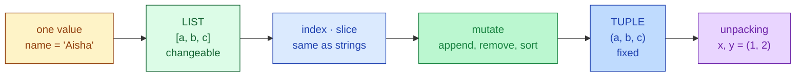

# Session 1.2 — Pre-Class Notes

> **Read this before the live class.**

---

## What you'll do in class

- Store **many values in one variable** using **lists** `[ ]` and **tuples** `( )`
- Access items by position (indexing) and ranges (slicing)
- **Modify** lists — add, remove, sort
- Understand why some collections are **changeable** and others **fixed**

### How a list looks in memory


*Diagram by [Tropwine](https://commons.wikimedia.org/wiki/File:1D_array_diagram.svg) — [CC BY 4.0](https://creativecommons.org/licenses/by/4.0/). A Python list is exactly this — a row of slots, each holding one item, indexed from 0.*

### 🗺️ Today's journey



<details>
<summary>👀 <b>30-second sneak peek</b> — click to see what these will look like in code</summary>

```python
# LIST — changeable
subjects = ["Maths", "Physics", "Chemistry"]
subjects.append("Biology")     # add to end
print(subjects[0])             # Maths
print(len(subjects))           # 4

# TUPLE — fixed
point = (12, 25)
x, y = point                   # unpacking — both at once!
print(f"x = {x}, y = {y}")
# → x = 12, y = 25

# Try to change a tuple → Python refuses
# point[0] = 99   # ❌ TypeError
```

Don't memorise — just notice the *shape*. Square brackets `[ ]` = list. Parentheses `( )` = tuple.

</details>

---

## Two questions to think about

Don't search — bring your **guesses** to class.

1. In Session 1.1 you stored **one** value per variable (`age = 21`). What if you needed to store the marks of **all 60 students**? How would you do it with what you know so far?
2. Your phone stores your contacts list (changes daily) and your phone's screen resolution (`1920 × 1080` — never changes). Should the **same** kind of container hold both? Why or why not?

---

## Setup

Open a fresh Colab notebook called `s1-2-lists-tuples.ipynb` before class. (If you missed 1.1, run `print("Ready for 1.2")` in a cell to confirm Python works.)

---

## A small reminder before we start

Confusion is still the job. Bring the three biggest "wait, what?" moments from Session 1.1 — we'll clear them at the start.

---

See you in class 🚀
