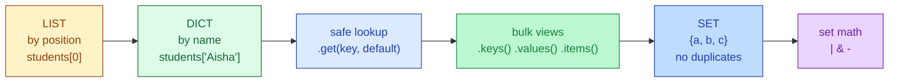
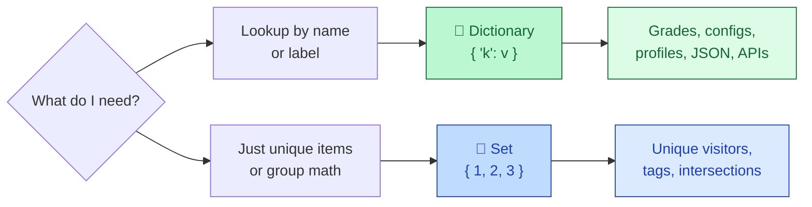
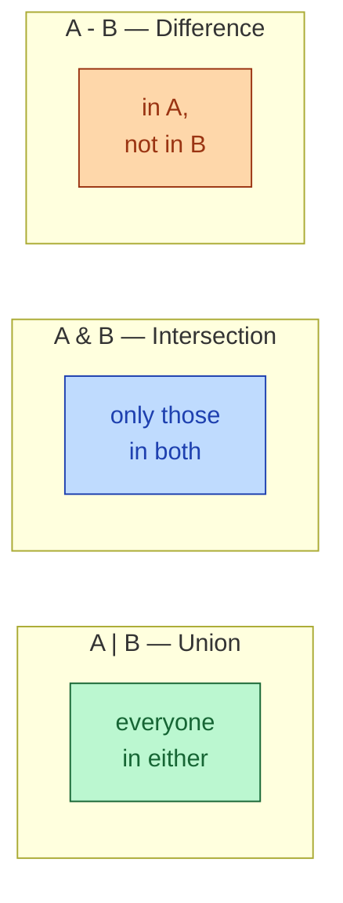
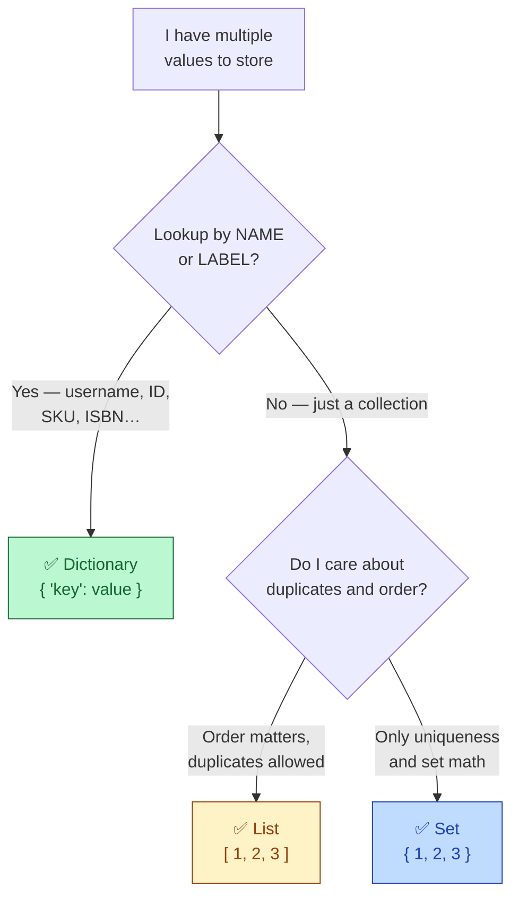

# Session 2.1 — Live Class

> **Module 1:** Python Programming Fundamentals and Flow Control
> **Title:** Advanced Data Structures — Dictionaries & Sets
> **Mentor:** Industry Mentor

---

## 🗺️ Today's journey



We'll move left to right. Each block builds on the one before — look back here any time to see where we are.

---

## The lookup problem

Imagine I hand you a 1,000-page paper dictionary and ask you to find the word **"Machine"**. Do you start at page 1 and check every word? Of course not — you jump straight to the **'M'** section.

Last class, every container we used was a **list** — items lined up by position. To find Priya's grade in a list of 60 students, the computer checks slot 0, slot 1, slot 2 … until it finds her. With 60 students, fine. With **60 million** users? Painfully slow.

> **A dictionary is a phone book. You give it a name, it gives you the number — instantly.**

### Three superpowers a dictionary gives you

1. **Lookup by meaningful name** — `grades["Priya"]`, not `grades[37]`.
2. **Lookup is essentially instant**, no matter how big the dictionary gets.
3. **Maps directly to real-world records** — usernames → passwords, products → prices, ISBN → book.

### Today's two new structures

```
Dict →  { "key": value }   →  fast lookup by name      →  phone book
Set  →  { 1, 2, 3 }        →  unique items, group math →  Venn diagram
```



---

## Dictionaries — keys and values

A dictionary stores data in **key-value pairs**. The **key** is the name you look up; the **value** is the data attached to it.

```python
grades = {
    "Rahul": 85,
    "Priya": 92,
    "Amit":  78,
}
```

Three things to notice:

1. **Curly braces** `{ }` with **colons** `:` — that's the dict signature.
2. Each entry is `key: value`, separated by commas.
3. **Keys must be unique.** Values can repeat (two students can have the same score).

### The phone-book analogy

Think of a dictionary like a contact list on your phone. Each entry has a **name** (key) and a **number** (value). You scroll to the name, you get the number. You don't memorise positions.

```
grades = { "Rahul": 85,  "Priya": 92,  "Amit": 78 }
            └ key ┘ val   └ key ┘ val   └ key ┘ val
```

### Looking up a value

```python
print(grades["Priya"])     # 92
```

> 💡 **Notice:** We use **curly braces `{}`** to *create* a dictionary, but **square brackets `[]`** to *look up* a value. Same square-bracket syntax as lists — but instead of an index number, we pass a key.

### Common mistake — `KeyError`

```python
print(grades["Suresh"])    # ❌ KeyError: 'Suresh'
```

If the key doesn't exist, the program **crashes**. In a real app — pulling a user record, parsing a config, reading an API response — that single missing key kills the whole script.

---

## Dictionaries — the safe lookup with `.get()`

The `.get()` method looks up a key **without crashing**. If the key is missing, it returns `None` — or a default value you specify.

```python
grades = {"Rahul": 85, "Priya": 92, "Amit": 78}

print(grades.get("Priya"))                       # 92
print(grades.get("Suresh"))                      # None — no crash
print(grades.get("Suresh", "Student Not Found")) # 'Student Not Found'
```

> ⚠️ **The professional rule:** In real code, **always use `.get()`** unless you are 100% certain the key exists. Square-bracket lookup `dict[key]` is fine in throwaway scripts. In anything that runs more than once, `.get()` saves you from production crashes.

### Adding and updating

```python
grades["Neha"] = 95          # adds a new key-value pair
print(grades)
# {'Rahul': 85, 'Priya': 92, 'Amit': 78, 'Neha': 95}

grades["Amit"] = 82          # key already exists → updates the value
print(grades)
# {'Rahul': 85, 'Priya': 92, 'Amit': 82, 'Neha': 95}
```

**Same syntax for adding and updating.** Python checks if the key exists. If yes → update. If no → add. There is no separate `.add()` method.

### Removing

```python
del grades["Rahul"]          # remove the key entirely
removed = grades.pop("Amit") # remove and return the value
print(removed)               # 82
```

- **`del dict[key]`** — straight delete, returns nothing.
- **`.pop(key)`** — removes the key and gives you the value back.

---

## Dictionaries — bulk views

Sometimes you want all the keys, all the values, or both at once.

```python
grades = {"Rahul": 85, "Priya": 92, "Amit": 78}

print(grades.keys())     # dict_keys(['Rahul', 'Priya', 'Amit'])
print(grades.values())   # dict_values([85, 92, 78])
print(grades.items())    # dict_items([('Rahul', 85), ('Priya', 92), ('Amit', 78)])
```

Three views, three uses:

- **`.keys()`** — when you only need the names.
- **`.values()`** — when you only need the data.
- **`.items()`** — when you need both, **as tuples**. (We learned tuples in 1.2 — see them already paying off.)

### Membership check

```python
print("Priya" in grades)     # True   — checks against KEYS, not values
print(92 in grades)          # False  — 92 is a value, not a key
print(92 in grades.values()) # True
```

> 💡 **`in` checks keys by default.** To check whether a *value* exists, ask `value in dict.values()`.

### Length

```python
print(len(grades))           # 3 — number of key-value pairs
```

---

## Sets — the power of uniqueness

A **set** is a collection where **duplicates are forbidden**. If you try to add the same item twice, the second one is silently ignored.

### The duplicate problem

```python
visitors = ["Rahul", "Amit", "Rahul", "Priya", "Amit", "Neha"]
print(visitors)                       # ['Rahul', 'Amit', 'Rahul', 'Priya', 'Amit', 'Neha']
print(len(visitors))                  # 6   — every visit, including repeats

unique = set(visitors)
print(unique)                         # {'Rahul', 'Amit', 'Priya', 'Neha'}
print(len(unique))                    # 4   — actual humans
```

One function call. Duplicates gone.

### Creating a set

```python
fruits  = {"apple", "banana", "mango"}
numbers = {1, 2, 3, 3, 3, 4}
empty   = set()                       # ⚠️  NOT {} — that makes an empty DICT
print(numbers)                        # {1, 2, 3, 4}  — duplicates removed automatically
```

> ⚠️ **The empty-braces trap:** `{}` creates an **empty dictionary**, NOT an empty set. To make an empty set, use `set()`. This trips up everyone exactly once. Now you know.

### The unordered rule

```python
nums = {3, 1, 2, 5, 4}
print(nums)            # may print {1, 2, 3, 4, 5} — Python decides the order
print(nums[0])         # ❌ TypeError: 'set' object is not subscriptable
```

**Sets have no order.** You cannot ask for "the first" or "the third" item — there is no such thing. A set only knows whether something is *in* it, not *where*. If order matters, use a list.

### Membership check is the killer feature

```python
big_set  = set(range(1_000_000))      # 1 million items
big_list = list(range(1_000_000))

999_999 in big_set     # essentially instant
999_999 in big_list    # has to check every slot — slow
```

When all you need is "is this thing in the group?", sets are dramatically faster than lists at scale.

---

## Set math — union, intersection, difference

If you remember Venn diagrams from school math, you already know how Python sets work.

```python
ai_students  = {"Rahul", "Priya", "Amit"}
web_students = {"Amit",  "Neha",  "Rahul"}

# Union — everyone in EITHER class (no duplicates)
print(ai_students | web_students)
# {'Rahul', 'Priya', 'Amit', 'Neha'}

# Intersection — everyone in BOTH classes
print(ai_students & web_students)
# {'Rahul', 'Amit'}

# Difference — only in AI, not in Web
print(ai_students - web_students)
# {'Priya'}

# Symmetric difference — in EITHER, but not BOTH
print(ai_students ^ web_students)
# {'Priya', 'Neha'}
```



### Modifying a set

```python
fruits = {"apple", "banana"}

fruits.add("mango")          # add one item
print(fruits)                # {'apple', 'banana', 'mango'}

fruits.discard("banana")     # remove if present, no error if missing
print(fruits)                # {'apple', 'mango'}

fruits.remove("kiwi")        # ❌ KeyError if not present
```

- **`.add(item)`** — add one. (Sets don't have `.append()` — they're not ordered.)
- **`.discard(item)`** — remove if present, do nothing if not.
- **`.remove(item)`** — remove, but **crashes** if the item isn't there. Use `.discard()` when you're not sure.

---

## List vs. dict vs. set — choosing the right tool

You now have three main containers. The decision tree:



### The cheat sheet

| Container | Syntax | Best used for | Duplicates? | Ordered? | Lookup by |
|---|---|---|---|---|---|
| **List** | `[1, 2, 3]` | Sequences, ordered data | Yes | Yes | index |
| **Dict** | `{"a": 1}` | Fast lookup by name | Keys: no · Values: yes | Insertion order | key |
| **Set**  | `{1, 2, 3}` | Unique items, group math | No | No | membership only |

### Quick decision drill

For each, decide: **list**, **dict**, or **set**?

- All the songs in a playlist (order matters, repeats allowed)?
- Usernames mapped to passwords?
- Email addresses that have already replied to a survey?
- A leaderboard (positions 1, 2, 3 …)?
- The unique tags across all blog posts?
- A product catalog: SKU → price?

---

## Iterating — a quick taste

You'll see this often. We cover loops formally in Session 3.1, but the syntax is short enough to glance at now:

```python
grades = {"Rahul": 85, "Priya": 92, "Amit": 78}

for name in grades:                  # iterates over KEYS
    print(name)

for score in grades.values():        # iterates over values
    print(score)

for name, score in grades.items():   # tuple unpacking — both at once!
    print(f"{name} scored {score}")
```

Notice block 3 — **tuple unpacking** from 1.2, applied to a dictionary. Two variables `name, score`, one tuple `(key, value)` per iteration. This is the most common loop you'll write with dictionaries in real code.

---

## In-class practice

Three quick problems. Try first — solutions are in the post-class README.

### Problem 1 — Build a profile

Create a dictionary `profile` with three keys: `'name'`, `'age'`, `'city'`. Fill it with your details. Then print only the city using square-bracket lookup, and try to print `'phone_number'` using `.get()` with a default of `'No number provided'`.

### Problem 2 — Count unique tags

You have:
```python
tags = ["AI", "ML", "AI", "Python", "ML", "DL", "AI"]
```
In **one line**, print the number of unique tags. *(Hint: combine `set()` and `len()`.)*

### Problem 3 — Spot the bug

**Without** running it, predict what each line prints (or whether it crashes):

```python
empty_set = {}
print(type(empty_set))

names = ["Aarav", "Priya", "Aarav"]
unique_names = set(names)
print(unique_names[0])
```

Then check by running. What did each line do? How would you fix line 1 if you wanted an actual empty set?

> 💡 If problem 3 felt mean — that's the point. You've now made these mistakes **once** in a controlled setting instead of alone in production.

---

## Topics covered

Boxes get ticked as we work through them in the live class.

- [ ] Core Python Data Structures
- [ ] Dictionaries — keys, values, lookup, `.get()`
- [ ] Dictionary methods — adding, updating, removing, `.keys()`, `.values()`, `.items()`
- [ ] Sets — creation, uniqueness, `.add()`, `.discard()`
- [ ] Set operations — union `|`, intersection `&`, difference `-`
- [ ] List vs. dict vs. set — when to use which

## Learning outcomes

By the end of this session you will have demonstrated:

- [ ] Managing key-value pairs for optimized data retrieval
- [ ] Utilizing sets for unique element operations
- [ ] Handling missing keys safely with `.get()`
- [ ] Choosing the right structure (list, dict, set) for a given problem

---

## Code from this session

This folder will hold the `.py` files we built together during the live class.
**Files appear here AFTER the lecture is pushed** to GitHub.

If you're seeing this folder before class — that's expected. Bring your laptop;
we'll build everything from scratch together. The reference copy gets pushed
here so you have a clean version for revision.
