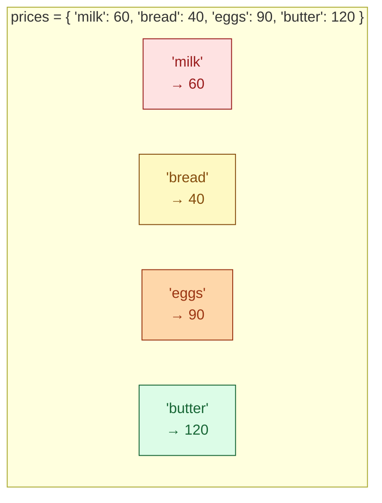

# Session 2.1 — Post-Class Assignments

> **Work through Set 1 + the mini-build.** Set 2 is bonus — try it if you want extra practice.
> **Tools:** Google Colab. One new notebook called `s2-1-homework.ipynb`.

---

## How to do these problems

1. Open Colab → New notebook → name it `s2-1-homework.ipynb`.
2. For **each problem**, create a new code cell.
3. **Try without peeking at the solutions** at the bottom. Sit with the problem before scrolling — confusion is the job.
4. If a problem feels impossible, write down *what you tried* and *where you got stuck*. Bring it to Session 2.2.
5. Save the notebook (auto-saves to your Google Drive).

---

## Set 1 — Drill (10 problems)

### 1. Build a dictionary
Create a dictionary called `prices` with these four entries: `"milk": 60`, `"bread": 40`, `"eggs": 90`, `"butter": 120`. Print it.

### 🔍 Visual cheat sheet — dictionary lookup (use this for Q2 + Q3)



> 💡 Square brackets `prices["milk"]` looks up the value. If the key is missing it crashes (`KeyError`). `prices.get("sugar", 0)` looks up safely with a default value.

### 2. Lookup practice
Using your `prices` dictionary:
- Print the price of `bread`.
- Try to print the price of `sugar` using square brackets — comment what happens.
- Print the price of `sugar` using `.get()` with a default of `0`.

### 3. Add and update
Starting from the original `prices`:
- Add `"sugar"` with a price of `50`.
- Update `"milk"` to `65` (price went up).
- Remove `"butter"` using `del`.
- Print the final dictionary.

> 🎬 **One-click visualizer:** [open this in Python Tutor](https://pythontutor.com/visualize.html#code=prices%20%3D%20%7B%22milk%22%3A%2060%2C%20%22bread%22%3A%2040%2C%20%22eggs%22%3A%2090%2C%20%22butter%22%3A%20120%7D%0Aprices%5B%22sugar%22%5D%20%3D%2050%0Aprices%5B%22milk%22%5D%20%3D%2065%0Adel%20prices%5B%22butter%22%5D%0Aprint%28prices%29&mode=edit&py=3) — code is pre-loaded. Click **Visualize Execution** and step through to *see* each key appear, update, and disappear.

### 4. Bulk views
Given `grades = {"Rahul": 85, "Priya": 92, "Amit": 78}`:
- Print only the names (the keys).
- Print only the scores (the values).
- Print every `name → score` line using `.items()` and an f-string.

### 5. Membership check
Given the same `grades` dictionary:
- Check whether `"Priya"` is in `grades` (should give `True`).
- Check whether `92` is in `grades` (should give `False` — `92` is a value, not a key).
- Check whether `92` is in `grades.values()` (should give `True`).

### 6. Build a set
Create a set `colors = {"red", "green", "blue"}`. Add `"yellow"`. Try to add `"red"` again. Print the set — confirm there are still only four colours.

### 7. Deduplicate a list
Given `tags = ["AI", "ML", "AI", "Python", "ML", "DL", "AI"]`:
- Print the **unique** tags using `set()`.
- Print **how many** unique tags there are.

### 8. The empty-braces trap
Predict (in a comment), then run:
```python
a = {}
b = set()
print(type(a))
print(type(b))
```
Why does `{}` create a dictionary, not an empty set? How do you make an empty set?

### 9. Set operations
Given:
```python
ai_students  = {"Rahul", "Priya", "Amit"}
web_students = {"Amit",  "Neha",  "Rahul"}
```
Print:
- All students across both classes (union).
- Students in **both** classes (intersection).
- Students **only** in AI, not Web (difference).

### 10. Set or list?
For each scenario, decide: **set** or **list**? Write a one-line comment explaining your choice.
- A music playlist where order matters and the same song can repeat.
- The unique email addresses of everyone who replied to a survey.
- The list of items in a shopping cart.
- The set of skills required for a job role (each skill listed once).

---

## Set 2 — Bonus (5 problems)

### 11. Nested dictionary
Create a dictionary that maps student names to their full record:
```python
students = {
    "Aarav": {"age": 22, "city": "Mumbai", "gpa": 8.5},
    "Priya": {"age": 21, "city": "Bangalore", "gpa": 9.1},
}
```
Print:
- Priya's full record.
- Just Priya's GPA. *(Hint: two square-bracket lookups, like nested lists in 1.2.)*

### 12. The KeyError demo
Predict (in a comment), then run:
```python
config = {"host": "localhost", "port": 8080}
print(config["password"])
```
What error do you get? Now fix the line so it prints `"not set"` if `password` is missing.

### 13. Iterating with `.items()`
Given `inventory = {"apple": 30, "banana": 15, "mango": 8}`, print every line in this format using a `for` loop:
```
We have 30 apple(s)
We have 15 banana(s)
We have 8 mango(s)
```
*(Hint: `for name, qty in inventory.items():` — tuple unpacking in action.)*

### 14. Symmetric difference
Given:
```python
team_a = {"Rahul", "Priya", "Amit"}
team_b = {"Amit",  "Neha",  "Sneha"}
```
Print the people who are in **exactly one** team (not both). *(Hint: `^` operator.)*

### 15. Common configuration keys
You have two configurations:
```python
dev  = {"host", "port", "debug", "log_level"}
prod = {"host", "port", "ssl_cert", "log_level"}
```
- Print the keys present in **both** environments.
- Print the keys that are in `dev` but **missing** in `prod`.
- Print the keys that are in `prod` but **missing** in `dev`.

---

## Mini-Build — "Class Gradebook"

Build a small program that manages student grades using a dictionary.

### Spec
1. Start with this dictionary:
   ```python
   gradebook = {
       "Aarav": 78,
       "Priya": 92,
       "Ravi":  65,
       "Sneha": 88,
   }
   ```
2. Operations to perform (in this order):
   - **Add** `"Kiran"` with a score of `81`.
   - **Update** `"Ravi"` to `72` (he retook the test).
   - **Remove** `"Aarav"` from the gradebook.
   - **Look up** `"Suresh"` safely using `.get()` with a default of `"Not enrolled"`.
3. Compute:
   - **Total students** using `len()`.
   - **Highest score** using `max(gradebook.values())`.
   - **Lowest score** using `min(gradebook.values())`.
4. Print exactly this report:

```
========================================
       CLASS GRADEBOOK REPORT
========================================
Students   : 4
Highest    : 92
Lowest     : 72
Suresh     : Not enrolled
Roster     : ['Priya', 'Ravi', 'Sneha', 'Kiran']
========================================
```

### Constraints
- Use **at least three** dictionary operations (assign, `del`, `.get()`, `.values()`, etc.).
- Use **`len()`** for the student count.
- Use **`max()` / `min()`** on `.values()` for highest/lowest.
- Use **f-strings** for the report.
- Keep it under 20 lines of code.

---

## Bonus Mini-Build — "Tag Aggregator" (optional)

> 🟡 **Optional.** A taste of how dicts + sets work together.

### The problem

You're analysing tags across blog posts. Build:
- A **dictionary** of post → list of tags (each post has a few tags).
- Use **sets** to find: every unique tag across the site, tags shared by *every* post, and tags unique to one post.

### Spec
1. Create:
   ```python
   posts = {
       "post-1": ["AI", "Python", "Tutorial"],
       "post-2": ["AI", "ML", "Python"],
       "post-3": ["AI", "Python", "DataScience"],
   }
   ```
2. Compute:
   - **All unique tags** across the site (union of all tag lists).
   - **Tags in every post** (intersection of all tag lists).
   - **Tags unique to `post-2`** (in `post-2` but not in `post-1` or `post-3`).
3. Print a tag report:

```
--- Tag Report ---
All unique : {'AI', 'Python', 'Tutorial', 'ML', 'DataScience'}
In every   : {'AI', 'Python'}
Only in 2  : {'ML'}
```

### Constraints
- Convert each post's tag list to a set before doing math.
- Don't hardcode the answers — compute them with `|`, `&`, `-`.

<details>
<summary>💡 <b>Stuck on a step?</b> Click for graduated hints</summary>

- **All unique tags:** convert each list to a set (`set(posts["post-1"])`), then chain unions: `set(posts["post-1"]) | set(posts["post-2"]) | set(posts["post-3"])`.
- **In every post:** same idea, but use `&` instead of `|`. Intersection keeps only tags present in all three.
- **Only in post-2:** start with `set(posts["post-2"])`, then subtract the others: `... - set(posts["post-1"]) - set(posts["post-3"])`.
- **Order in output:** sets are unordered — your printout may show items in a different order. That's fine.

</details>

---

## 🛠️ Stuck? Visualise it

Dictionaries and sets are easier to *see* than to *imagine*. Use these.

| Tool | What it's for |
|------|----------------|
| 🔍 [**Python Tutor**](https://pythontutor.com/visualize.html#mode=edit) | Paste your dict/set code, hit "Visualize Execution", step through. You'll *see* keys appear, values update, and the red error when you try to index a set. |
| 📖 [**Python docs — Dictionaries**](https://docs.python.org/3/tutorial/datastructures.html#dictionaries) | Official reference for dictionaries. |
| 📋 [**Python docs — Sets**](https://docs.python.org/3/tutorial/datastructures.html#sets) | Official reference for sets and set operations. |
| 📚 [**W3Schools — Dictionaries**](https://www.w3schools.com/python/python_dictionaries.asp) · [**Sets**](https://www.w3schools.com/python/python_sets.asp) | Cheatsheet style — fast lookup with examples. |

> **Try this in Python Tutor:** paste any of the homework problems into [pythontutor.com/visualize.html](https://pythontutor.com/visualize.html#mode=edit), step through, and watch keys appear and values update. The "wait, what just happened?" feeling vanishes.

---

## Reflection — write in a markdown cell

1. **What clicked today?** One thing that made sense quickly.
2. **What's still fuzzy?** One thing you'd want me to re-explain in 2.2. Be specific.
3. **List vs. dict vs. set — in your own words:** when would you reach for each? Try one sentence per container.

---

## Preview — Session 2.2

**Title:** Control Flow and Decision Making

So far your programs run top-to-bottom — line 1, line 2, line 3, done. They're calculators. Next class we give your code a **brain**: it'll *make decisions* using `if`, `elif`, and `else`. Combined with the data structures you now know, this is what turns a script into a real application — a self-driving car's traffic-light logic, a bank's loan-approval rules, a chatbot's response branching. See you next class.

---

<details>
<summary><b>Solutions — try first, then peek</b></summary>

### Set 1

```python
# 1
prices = {"milk": 60, "bread": 40, "eggs": 90, "butter": 120}
print(prices)

# 2
print(prices["bread"])                       # 40
# print(prices["sugar"])                     # KeyError — crashes
print(prices.get("sugar", 0))                # 0

# 3
prices["sugar"] = 50
prices["milk"]  = 65
del prices["butter"]
print(prices)

# 4
grades = {"Rahul": 85, "Priya": 92, "Amit": 78}
print(grades.keys())                         # dict_keys([...])
print(grades.values())                       # dict_values([...])
for name, score in grades.items():
    print(f"{name} → {score}")

# 5
print("Priya" in grades)                     # True
print(92 in grades)                          # False — 92 is a value, not a key
print(92 in grades.values())                 # True

# 6
colors = {"red", "green", "blue"}
colors.add("yellow")
colors.add("red")                            # silently ignored — already in
print(colors)                                # 4 colours

# 7
tags = ["AI", "ML", "AI", "Python", "ML", "DL", "AI"]
print(set(tags))                             # {'AI', 'ML', 'Python', 'DL'}
print(len(set(tags)))                        # 4

# 8 — {} creates a dict (Python's design choice — dicts came first).
#       To make an empty set, use set().
a = {}
b = set()
print(type(a))                               # <class 'dict'>
print(type(b))                               # <class 'set'>

# 9
ai  = {"Rahul", "Priya", "Amit"}
web = {"Amit",  "Neha",  "Rahul"}
print(ai | web)                              # union
print(ai & web)                              # intersection
print(ai - web)                              # only in AI

# 10 — list (order, repeats), set (unique emails), list (cart can repeat),
#       set (skills are unique by name).
```

### Set 2

```python
# 11
students = {
    "Aarav": {"age": 22, "city": "Mumbai", "gpa": 8.5},
    "Priya": {"age": 21, "city": "Bangalore", "gpa": 9.1},
}
print(students["Priya"])                     # full record
print(students["Priya"]["gpa"])              # 9.1

# 12 — KeyError: 'password'. Fix:
config = {"host": "localhost", "port": 8080}
print(config.get("password", "not set"))     # 'not set'

# 13
inventory = {"apple": 30, "banana": 15, "mango": 8}
for name, qty in inventory.items():
    print(f"We have {qty} {name}(s)")

# 14
team_a = {"Rahul", "Priya", "Amit"}
team_b = {"Amit",  "Neha",  "Sneha"}
print(team_a ^ team_b)                       # in exactly one team

# 15
dev  = {"host", "port", "debug", "log_level"}
prod = {"host", "port", "ssl_cert", "log_level"}
print(dev & prod)                            # in both
print(dev - prod)                            # only in dev
print(prod - dev)                            # only in prod
```

### Mini-Build — Class Gradebook

```python
gradebook = {"Aarav": 78, "Priya": 92, "Ravi": 65, "Sneha": 88}

gradebook["Kiran"] = 81
gradebook["Ravi"]  = 72
del gradebook["Aarav"]
suresh = gradebook.get("Suresh", "Not enrolled")

print("=" * 40)
print("       CLASS GRADEBOOK REPORT")
print("=" * 40)
print(f"Students   : {len(gradebook)}")
print(f"Highest    : {max(gradebook.values())}")
print(f"Lowest     : {min(gradebook.values())}")
print(f"Suresh     : {suresh}")
print(f"Roster     : {list(gradebook.keys())}")
print("=" * 40)
```

### Bonus Mini-Build — Tag Aggregator

```python
posts = {
    "post-1": ["AI", "Python", "Tutorial"],
    "post-2": ["AI", "ML", "Python"],
    "post-3": ["AI", "Python", "DataScience"],
}

p1, p2, p3 = set(posts["post-1"]), set(posts["post-2"]), set(posts["post-3"])

all_unique = p1 | p2 | p3
in_every   = p1 & p2 & p3
only_in_2  = p2 - p1 - p3

print("--- Tag Report ---")
print(f"All unique : {all_unique}")
print(f"In every   : {in_every}")
print(f"Only in 2  : {only_in_2}")
```

</details>
