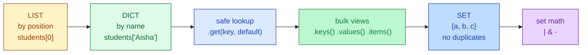

# Session 2.1 — Pre-Class Notes

> **Read this before the live class.**

---

## What you'll do in class

- Look up data **by name**, not by position, using **dictionaries** `{ }`
- Handle missing keys safely with **`.get()`** instead of crashing
- Use **sets** `{ }` to throw away duplicates and compare groups
- Pick the right container — list, dict, or set — for a given problem

### 🗺️ Today's journey



<details>
<summary>👀 <b>30-second sneak peek</b> — click to see what these will look like in code</summary>

```python
# DICT — look up by name
grades = {"Rahul": 85, "Priya": 92, "Amit": 78}
print(grades["Priya"])              # 92

# Safe lookup — no crash if the name doesn't exist
print(grades.get("Suresh", "Not found"))    # Not found

# SET — uniqueness, automatic
visitors = ["Rahul", "Amit", "Rahul", "Priya", "Amit"]
print(set(visitors))                # {'Rahul', 'Amit', 'Priya'}

# Set math — Venn diagram in code
ai = {"Rahul", "Priya", "Amit"}
web = {"Amit", "Neha", "Rahul"}
print(ai & web)                     # {'Rahul', 'Amit'} — taking BOTH
```

Don't memorise — just notice the *shape*. Curly braces with colons `{ "k": v }` = dict. Curly braces without colons `{ a, b, c }` = set.

</details>

---

## Two questions to think about

Don't search — bring your **guesses** to class.

1. In Session 1.2 you stored 60 student names in a list. To find Priya's index, the computer has to check each slot until it finds her. Now imagine you store them as a dictionary keyed by name. Why might this be much faster when there are millions of students?
2. You're tracking visitors to your website. Every refresh adds a row. By the end of the day you have 50,000 rows — but many people visited multiple times. How would you find the count of **unique humans** without writing a long deduplication loop?

---

## Setup

Open a fresh Colab notebook called `s2-1-dicts-sets.ipynb` before class. (If you missed 1.2, run `print({"k": "v"})` in a cell to confirm Python works — that's a dictionary.)

---

## A small reminder before we start

Confusion is still the job. Bring the three biggest "wait, what?" moments from Session 1.2 — we'll clear them at the start.

---

See you in class 🚀
