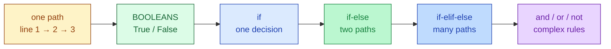
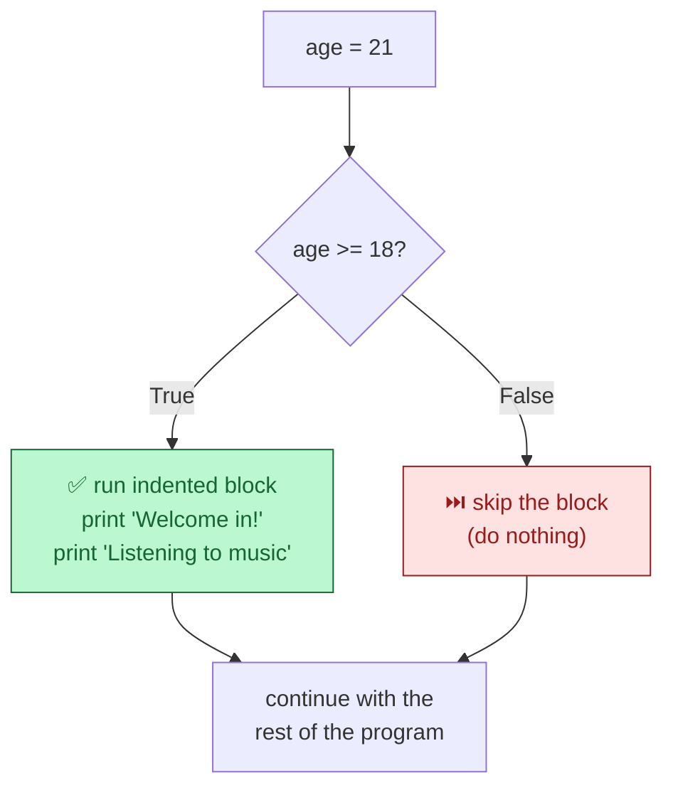
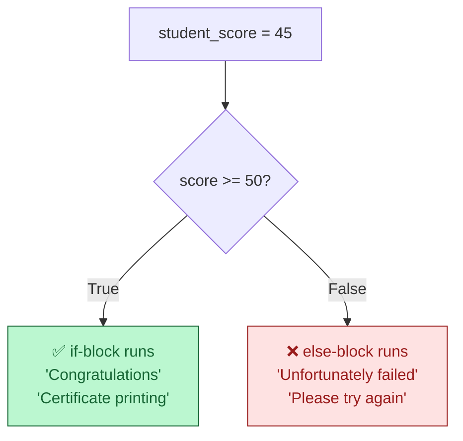
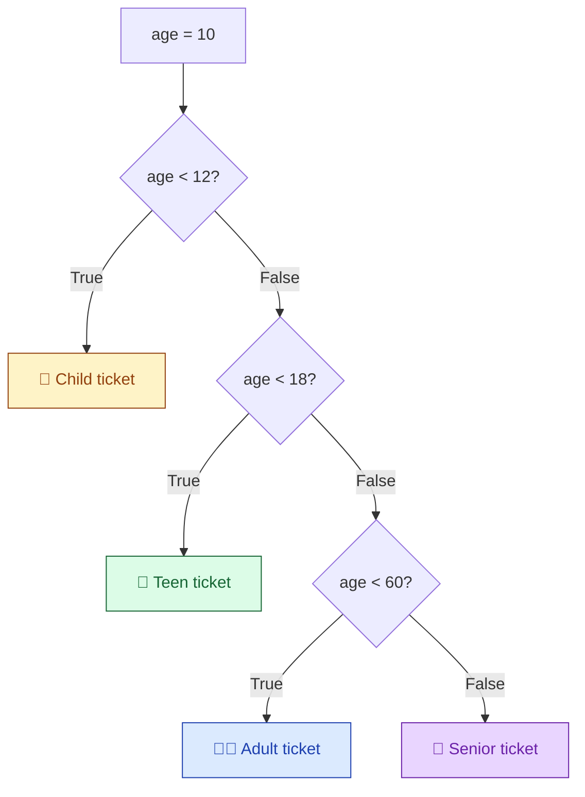

# Session 2.2 — Live Class

> **Module 1:** Python Programming Fundamentals and Flow Control
> **Title:** Control Flow and Decision Making
> **Mentor:** Industry Mentor

---

## 🗺️ Today's journey



We'll move left to right. Each block builds on the one before — look back here any time to see where we are.

---

## Why your code needs a brain

Imagine you're building the brain of a Tesla. The car approaches a traffic light. What does the code look like to tell the car what to do?

The car has to ask a question — *"Is the light red?"* — and then choose:

- **Yes** → press the brakes.
- **No** → press the gas.

Without the ability to **ask questions and make choices**, the car would just drive straight into a wall.

Up until today, your Python scripts were like a train on a single track. They run line 1, then line 2, then line 3, and stop. They are calculators.

> **Today, we give your code a brain.**

By the end of this session, your code can read data, make decisions, and choose different paths based on the information it sees. This is the absolute foundation of every real-world application — from spam filters to chatbots to fraud detection.

---

## The foundation — Booleans and comparisons

Before code can make a decision, it needs to ask a question. And computers only answer in two ways: `True` or `False`. We call these **Booleans**.

```python
print(True)
print(False)
print(type(True))     # <class 'bool'>
```

### Comparison operators

We ask questions using **comparison operators**. The computer evaluates each one and returns `True` or `False`.

```python
user_age = 20

print(user_age == 18)     # False — Equal to (notice the DOUBLE ==)
print(user_age != 18)     # True  — NOT equal to
print(user_age > 18)      # True  — Greater than
print(user_age < 18)      # False — Less than
print(user_age >= 20)     # True  — Greater than or equal to
print(user_age <= 19)     # False — Less than or equal to
```

| Operator | Meaning |
|---|---|
| `==` | Equal to |
| `!=` | Not equal to |
| `<` | Less than |
| `>` | Greater than |
| `<=` | Less than or equal to |
| `>=` | Greater than or equal to |

### ⚠️ The most important rule of the whole session

```python
x = 5      # this PUTS 5 inside x          (assignment)
x == 5     # this ASKS "is x equal to 5?"  (comparison)
```

**One equals sign assigns. Two equals signs ask a question.** This trips up everyone exactly once. Now you know.

---

## The bouncer — the `if` statement

The `if` statement is like a bouncer at a club. It checks your ID. **If** you pass the test, you go inside. **If** you fail, the bouncer ignores you.

### The simplest decision

```python
age = 21

print("Walking up to the club...")

if age >= 18:
    print("Bouncer: Welcome in!")
    print("You're listening to the music.")

print("Leaving the club and going home.")
```

### The four pieces of an `if` statement

```python
if age >= 18:           # ← keyword + condition + colon
    print("Welcome in!") # ← indented action (the body)
```

1. **The keyword** — `if`.
2. **The condition** — a question that returns `True` or `False`. (`age >= 18`.)
3. **The colon `:`** — the bouncer's velvet rope. Tells Python "rules are set, get ready for the actions."
4. **The indentation** — push action lines to the right (4 spaces or 1 Tab). This tells Python which lines belong **inside** the `if`.



> 💡 **Try it both ways:** Change `age` to `15` and re-run. The two indented lines are completely skipped — proof the code is making a decision.

### Common mistakes

```python
# ❌ Missing colon → SyntaxError
if age >= 18
    print("Adult")

# ❌ Missing indentation → IndentationError
if age >= 18:
print("Adult")

# ❌ Single = → SyntaxError (you tried to assign in a question)
if age = 18:
    print("Eighteen")
```

These are the three classic errors. Every Python beginner hits each one once. We're hitting them in class so you don't hit them alone in production.

---

## The fork in the road — the `else` statement

Right now, if the `if` fails, **nothing happens**. The code silently moves on. Often we want a **backup plan**: *"If it's raining, take an umbrella. **Otherwise**, wear sunglasses."*

That's `else`.

```python
student_score = 45

if student_score >= 50:
    print("Congratulations, you passed!")
    print("Your certificate is being printed.")
else:
    print("Unfortunately, you failed.")
    print("Please study and try again next month.")
```



### Two key rules

- **`else:` does not take a condition.** You don't ask a question with `else`. It literally means *"if everything above this was False, do this instead."*
- Same colon `:` after `else`, same indented block underneath. Same shape as `if`.

### ⚠️ Common mistake

```python
# ❌ Wrong — else doesn't take a condition
if age >= 18:
    print("Adult")
else age < 18:
    print("Minor")

# ✅ Right — else is the catch-all
if age >= 18:
    print("Adult")
else:
    print("Minor")
```

If you need *another* condition, you don't use `else` — you use `elif`. Coming up next.

---

## Multiple choices — the `elif` statement

Life is rarely just yes/no. A grading system has A, B, C, D, F. A traffic light has red, yellow, green. For more than two paths, we use **`elif`** — short for "else if".

```python
age = 10

if age < 12:
    print("Child ticket: ₹150")
elif age < 18:
    print("Teen ticket: ₹250")
elif age < 60:
    print("Adult ticket: ₹350")
else:
    print("Senior ticket: ₹200")
```

### How Python reads this



Two crucial rules:

- Python checks the conditions **top to bottom**.
- Once it finds the **first** `True` condition, it runs that block and **skips everything else**.

> 💡 Even though a 10-year-old is technically `< 18` and `< 60` too, Python stops at the **first** true statement (`age < 12`) and never checks the rest. Order matters.

### The shape

```
if   condition_1:    # check first
    ...
elif condition_2:    # only checked if condition_1 was False
    ...
elif condition_3:    # only checked if both above were False
    ...
else:                # catch-all — none of the above matched
    ...
```

You can have as many `elif` blocks as you need. The `else` is optional but usually a good idea — it catches the cases you didn't think of.

---

## Combining conditions — `and`, `or`, `not`

Sometimes a single condition isn't enough. To get a loan, you need **good salary AND good credit score**. To get into a movie, you need **a ticket OR be on the guest list**.

| Operator | Meaning |
|---|---|
| `and` | **Both** conditions must be `True` |
| `or` | **At least one** condition must be `True` |
| `not` | Flips `True` ↔ `False` |

### `and` — both must be True

```python
income = 60000
credit_score = 750

if income >= 50000 and credit_score >= 700:
    print("Loan Approved!")
else:
    print("Loan Denied.")
```

### `or` — at least one must be True

```python
has_ticket = False
is_on_guest_list = True

if has_ticket or is_on_guest_list:
    print("Come on in.")
else:
    print("Sorry, can't let you in.")
```

### `not` — flip the answer

```python
is_raining = False

if not is_raining:
    print("Go for a walk!")
```

### Truth tables

| `A` | `B` | `A and B` | `A or B` |
|---|---|---|---|
| `True`  | `True`  | `True`  | `True`  |
| `True`  | `False` | `False` | `True`  |
| `False` | `True`  | `False` | `True`  |
| `False` | `False` | `False` | `False` |

**`and` is strict** — every condition must hold. **`or` is forgiving** — one is enough.

---

## Nesting — a decision inside a decision

You can put an `if` inside another `if`. This is **nesting**.

```python
has_ticket = True
is_vip = False

if has_ticket:
    print("Welcome to the concert!")
    if is_vip:                              # nested inside the first if
        print("Here is your backstage pass!")
    else:
        print("Please head to general seating.")
else:
    print("You cannot enter without a ticket.")
```

The **inner** `if` only runs if the **outer** condition was `True`. Notice the **double indentation** — the inner block is pushed twice to the right.

### When to use nesting vs. `and`

These two are equivalent:

```python
# Option 1 — nested
if has_ticket:
    if is_vip:
        print("VIP entry")

# Option 2 — combined with `and`
if has_ticket and is_vip:
    print("VIP entry")
```

Use **`and`** when both checks are part of one decision. Use **nesting** when the inner decision only makes sense after the outer one passes (like checking VIP status only matters *after* you've confirmed they have a ticket).

---

## Working with data structures — bringing it together

You learned lists, tuples, dicts, and sets in the last two sessions. Combine them with `if`/`else` and your code can act on real data.

### Membership check

```python
allowed_users = {"admin", "alice", "bob"}      # set — fast membership
user = "alice"

if user in allowed_users:
    print(f"Welcome, {user}!")
else:
    print("Access denied.")
```

### Safe dictionary lookup + decision

```python
prices = {"milk": 60, "bread": 40, "eggs": 90}
item = "sugar"

price = prices.get(item)
if price is None:
    print(f"{item} is not stocked.")
else:
    print(f"{item} costs ₹{price}.")
```

> 💡 We use `is None` instead of `== None`. They're functionally the same here, but `is None` is the Pythonic way and what you'll see in real code.

### Length-based decisions

```python
cart = ["milk", "bread", "eggs"]

if len(cart) == 0:
    print("Cart is empty.")
elif len(cart) < 5:
    print("Small order.")
else:
    print("Big order — free delivery!")
```

You're not just deciding — you're deciding **based on the data structures you already know**. This is what makes a real program.

---

## In-class practice

Three quick problems. Try first — solutions are in the post-class README.

### Problem 1 — The hot-day check

Create a variable `temperature = 35`. Write an `if` statement: if the temperature is strictly greater than 30, print `"It's a hot day!"`. Try changing the value to `25` and re-running.

### Problem 2 — The traffic light

Create `light_color = "yellow"`. Use `if`, `elif`, and `else` to print:
- `"Stop"` for `"red"`
- `"Slow down"` for `"yellow"`
- `"Go"` for `"green"`
- `"Broken traffic light"` for anything else

### Problem 3 — Spot the bugs

**Without** running it, find every bug you can in this code:

```python
score = 75

if score = 100
    print("Perfect!")
elif score >= 50:
print("You passed.")
else age < 50:
    print("You failed.")
```

(There are at least four bugs — see if you can spot them all.) Then run the corrected version.

> 💡 If problem 3 felt mean — that's the point. You've now made these mistakes **once** in a controlled setting instead of alone in production.

---

## Topics covered

Boxes get ticked as we work through them in the live class.

- [ ] Booleans and comparison operators (`==`, `!=`, `<`, `>`, `<=`, `>=`)
- [ ] The `if` statement — condition, colon, indentation
- [ ] The `if-else` structure — backup plans
- [ ] The `if-elif-else` chain — multiple paths
- [ ] Logical operators — `and`, `or`, `not`
- [ ] Nesting — decisions inside decisions
- [ ] Combining with lists, dicts, sets

## Learning outcomes

By the end of this session you will have demonstrated:

- [ ] Implementing conditional logic for program branching
- [ ] Executing `if`/`else` statements for decision-making
- [ ] Combining conditions with `and`, `or`, `not`
- [ ] Avoiding the three classic errors (`=` vs `==`, missing colons, bad indentation)

---

## Code from this session

This folder will hold the `.py` files we built together during the live class.
**Files appear here AFTER the lecture is pushed** to GitHub.

If you're seeing this folder before class — that's expected. Bring your laptop;
we'll build everything from scratch together. The reference copy gets pushed
here so you have a clean version for revision.
