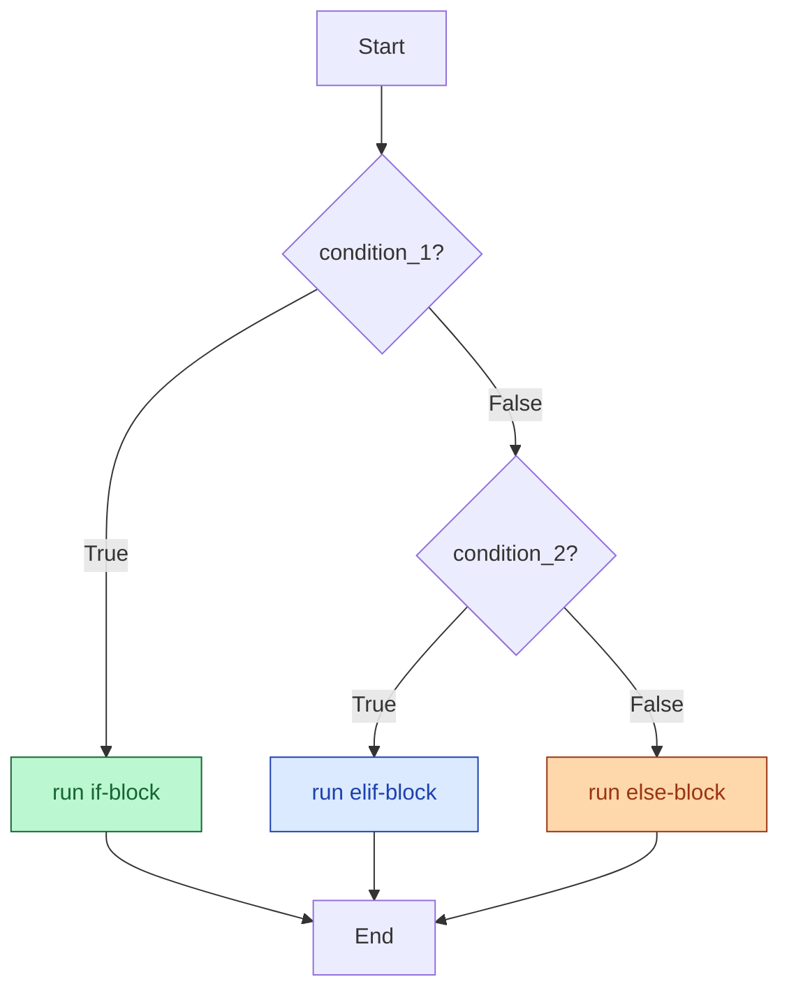

# Session 2.2 — Post-Class Assignments

> **Work through Set 1 + the mini-build.** Set 2 is bonus — try it if you want extra practice.
> **Tools:** Google Colab. One new notebook called `s2-2-homework.ipynb`.

---

## How to do these problems

1. Open Colab → New notebook → name it `s2-2-homework.ipynb`.
2. For **each problem**, create a new code cell.
3. **Try without peeking at the solutions** at the bottom. Sit with the problem before scrolling — confusion is the job.
4. If a problem feels impossible, write down *what you tried* and *where you got stuck*. Bring it to Session 3.1.
5. Save the notebook (auto-saves to your Google Drive).

---

## Set 1 — Drill (10 problems)

### 1. Comparisons return Booleans
Without running, predict — then run — what each prints:
```python
print(5 == 5)
print(5 != 5)
print(10 > 3)
print(10 <= 10)
print("apple" == "Apple")
```
Why does the last one print `False`?

### 2. The `if` skeleton
Create `score = 85`. Write an `if` statement that prints `"You passed!"` only if `score` is at least 50. Try with `score = 30` to confirm it skips silently.

### 🔍 Visual cheat sheet — the if-elif-else flow (use this for Q3 + Q5)



> 💡 Python checks conditions **top to bottom** and stops at the **first** `True`. That's why order matters in `elif` chains.

### 3. The else fallback
Create `password = "letmein"`. Write a script: if `password == "secret123"`, print `"Access Granted"`. Otherwise, print `"Intruder Alert!"`. Try both passwords.

### 4. The `=` vs `==` trap
Predict (in a comment), then run:
```python
age = 18
if age = 18:
    print("Just turned adult!")
```
What error do you get? Fix it so it correctly checks if `age` is `18`.

### 5. Movie ticket pricing
Write a function-free script that prices a movie ticket based on `age`:
- `< 12` → `"Child ticket: ₹150"`
- `12–17` (inclusive) → `"Teen ticket: ₹250"`
- `18–59` → `"Adult ticket: ₹350"`
- `60+` → `"Senior ticket: ₹200"`

Test with `age = 10`, `age = 16`, `age = 30`, `age = 70`.

> 🎬 **One-click visualizer:** [open this in Python Tutor](https://pythontutor.com/visualize.html#code=age%20%3D%2016%0A%0Aif%20age%20%3C%2012%3A%0A%20%20%20%20print%28%22Child%20ticket%3A%20%E2%82%B9150%22%29%0Aelif%20age%20%3C%2018%3A%0A%20%20%20%20print%28%22Teen%20ticket%3A%20%E2%82%B9250%22%29%0Aelif%20age%20%3C%2060%3A%0A%20%20%20%20print%28%22Adult%20ticket%3A%20%E2%82%B9350%22%29%0Aelse%3A%0A%20%20%20%20print%28%22Senior%20ticket%3A%20%E2%82%B9200%22%29&mode=edit&py=3) — code is pre-loaded. Click **Visualize Execution** and step through to *see* which branch Python actually runs.

### 6. The `and` rule
You're approving loans. Create:
```python
income = 60000
credit_score = 720
```
Write an `if` statement: only if **both** `income >= 50000` **and** `credit_score >= 700`, print `"Loan Approved!"`. Otherwise print `"Loan Denied."`.

### 7. The `or` rule
Create:
```python
has_ticket = False
on_guest_list = True
```
Print `"Welcome!"` if **either** is `True`, otherwise print `"Sorry, no entry."`.

### 8. The `not` operator
Create `is_weekend = True`. Use `not` to print `"Go to work."` if it is **not** the weekend, and `"Sleep in."` if it is.

### 9. Membership decision
Given:
```python
allowed_users = {"admin", "alice", "bob"}
current_user = "charlie"
```
Write an `if`/`else` that prints `"Access granted"` if `current_user` is in `allowed_users`, else `"Access denied"`.

### 10. Empty cart check
Given `cart = []`:
- If `cart` is empty (length 0), print `"Cart is empty."`.
- Else if it has fewer than 5 items, print `"Small order."`.
- Otherwise, print `"Big order — free delivery!"`.

Test with `cart = []`, `cart = ["milk"]`, and `cart = ["milk", "bread", "eggs", "butter", "sugar", "salt"]`.

---

## Set 2 — Bonus (5 problems)

### 11. Nested decisions
Build the entry logic for a concert.
- Outer check: do they have a ticket?
- If yes, inner check: are they VIP?
  - If yes: print `"Welcome! Backstage pass attached."`.
  - If no: print `"Welcome! Please head to general seating."`.
- If they don't have a ticket: print `"Cannot enter without a ticket."`.

Test all three combinations (ticket+VIP, ticket-only, no ticket).

### 12. The `or` shortcut
Predict (in a comment), then run:
```python
x = 0
if x:
    print("Truthy")
else:
    print("Falsy")
```
Then try the same with `x = 1`, `x = ""`, `x = "hello"`, `x = []`, `x = [0]`.

What does Python consider "falsy" by default? *(Hint: empty containers, zero, and `None` are all falsy.)*

### 13. Grade letter
Write a script that converts a numeric `score` to a letter grade:
- `90 ≤ score ≤ 100` → `"A"`
- `80 ≤ score < 90` → `"B"`
- `70 ≤ score < 80` → `"C"`
- `60 ≤ score < 70` → `"D"`
- `score < 60` → `"F"`
- `score < 0` or `score > 100` → `"Invalid score"`

Use `and` to combine the upper/lower bounds in the **first** check (`score >= 0 and score <= 100`).

### 14. Dictionary-driven decisions
Given:
```python
weather = {"city": "Delhi", "temp_c": 38, "raining": False}
```
Print:
- `"Stay hydrated"` if `temp_c >= 35`.
- `"Take an umbrella"` if it's raining.
- `"Perfect weather"` if it's not raining and temperature is between 18 and 28 (inclusive).

Use `.get()` for safe access. (Try also setting `weather["temp_c"] = 25` and `weather["raining"] = False` to test.)

### 15. Spot the bugs
This code has at least **four** bugs. Find and fix them all:
```python
score = 85

if score = 100
    print("Perfect!")
elif score >= 50:
print("You passed.")
else score < 50:
    print("You failed.")
```

<details>
<summary>💡 <b>Stuck on Q15?</b> Click for a hint about what to look for</summary>

Look for:
- Wrong assignment vs. comparison operator
- Missing colons after conditions
- Missing indentation under one of the branches
- A condition attached to `else` that shouldn't be there

</details>

---

## Mini-Build — "Automated Loan Officer"

Build a small program that decides loan eligibility — the kind of logic real banks run.

### Spec
1. Take three input variables (set them at the top of the cell):
   ```python
   age = 28
   salary = 75000
   has_existing_debt = False
   ```
2. The decision logic, in order:
   - If `age < 21`: print `"Rejected: Applicant is too young."` and stop.
   - Else if `salary < 40000`: print `"Rejected: Salary requirement not met."` and stop.
   - Else (age and salary OK):
     - If `has_existing_debt is True`: print `"Approved for Standard Card (due to existing debt)."`.
     - Else: print `"Approved for Premium Rewards Card!"`.
3. Test with all four combinations:
   - `age=19, salary=80000, has_existing_debt=False` → too young
   - `age=25, salary=30000, has_existing_debt=False` → salary too low
   - `age=30, salary=80000, has_existing_debt=True` → standard
   - `age=28, salary=95000, has_existing_debt=False` → premium

### Constraints
- Use `if`, `elif`, **and** `else` at least once each.
- Use **at least one nested** `if`.
- Use **f-strings** in your output to include the applicant's age and salary in each message.
- Keep it under 20 lines of code.

---

## Bonus Mini-Build — "Smart Thermostat" (optional)

> 🟡 **Optional.** A taste of how dicts + if/elif drive real device logic.

### The problem

You're building the brain of a smart thermostat. Given a sensor reading dictionary, decide what action to take.

### Spec
1. Create:
   ```python
   sensor = {"temp_c": 28, "humidity": 70, "occupied": True}
   ```
2. Decision logic:
   - If the room is **not occupied** (`occupied` is `False`), print `"Idle — no one home."` and stop.
   - Else (someone is home):
     - If `temp_c >= 30`: print `"AC ON — cooling."`.
     - Elif `temp_c <= 18`: print `"Heater ON — warming."`.
     - Elif `humidity >= 80`: print `"Dehumidifier ON."`.
     - Else: print `"Comfort range — standing by."`.
3. Test with at least four scenarios:
   - Empty room → idle
   - Hot day, occupied → AC on
   - Cold morning, occupied → heater on
   - Humid + comfortable temperature, occupied → dehumidifier
   - Pleasant + occupied → standing by

### Constraints
- Use `.get()` for every dictionary access (with sensible defaults).
- Use `not` to check `occupied is False`.
- Use **nesting** — the temperature checks only matter once we know the room is occupied.

<details>
<summary>💡 <b>Stuck on a step?</b> Click for graduated hints</summary>

- **Reading the sensor safely:** `temp = sensor.get("temp_c", 22)` — defaults to a safe room temperature if the key is missing.
- **Outer check:** `if not sensor.get("occupied", False):` handles "no one home" first.
- **Order matters:** in the inner `elif` chain, the very high or very low extremes come first. The "comfort range" `else` catches everything else.
- **Adding a fifth scenario?** Try `temp_c=35, humidity=85, occupied=True` — your logic should pick AC, not the dehumidifier (because temperature wins in your `elif` order).

</details>

---

## 🛠️ Stuck? Visualise it

`if`/`elif`/`else` flow can be hard to *see* if you're just reading code. Use these.

| Tool | What it's for |
|------|----------------|
| 🔍 [**Python Tutor**](https://pythontutor.com/visualize.html#mode=edit) | Paste your `if`-chain, hit "Visualize Execution", step through. You'll *see* Python skip past the false branches and run only the matching one — the magic of branching becomes obvious. |
| 📖 [**Python docs — `if` statements**](https://docs.python.org/3/tutorial/controlflow.html#if-statements) | Official reference for `if`/`elif`/`else`. |
| 📋 [**Python docs — Boolean operations**](https://docs.python.org/3/library/stdtypes.html#boolean-operations-and-or-not) | Detailed rules for `and`, `or`, `not`. |
| 📚 [**W3Schools — Python conditions**](https://www.w3schools.com/python/python_conditions.asp) | Beginner cheatsheet — fast lookup with examples. |

> **Try this in Python Tutor:** paste any of the homework problems into [pythontutor.com/visualize.html](https://pythontutor.com/visualize.html#mode=edit), step through, and watch which branch Python actually enters. The "did it really skip the others?" feeling vanishes.

---

## Reflection — write in a markdown cell

1. **What clicked today?** One thing that made sense quickly.
2. **What's still fuzzy?** One thing you'd want me to re-explain in 3.1. Be specific.
3. **`if` vs. `elif` vs. `else` — in your own words:** when do you reach for each? Try one sentence per keyword.

---

## Preview — Session 3.1

**Title:** Iteration and Loop Mastery

So far we've made decisions on **one** value at a time. But what if you have a list of 1,000 students and want to grade each one? Or a dictionary of 50,000 product prices and want to apply a 10% discount across the board? You don't write 1,000 `if` statements — you write a **loop**. Next class we learn `for` and `while` — the way Python automates repetition. Combined with the `if`/`else` you just learned, this is where your scripts start feeling like real software.

---

<details>
<summary><b>Solutions — try first, then peek</b></summary>

### Set 1

```python
# 1
print(5 == 5)             # True
print(5 != 5)             # False
print(10 > 3)             # True
print(10 <= 10)           # True
print("apple" == "Apple") # False — case-sensitive

# 2
score = 85
if score >= 50:
    print("You passed!")

# 3
password = "letmein"
if password == "secret123":
    print("Access Granted")
else:
    print("Intruder Alert!")

# 4 — SyntaxError: cannot use = in a condition. Fix:
age = 18
if age == 18:
    print("Just turned adult!")

# 5
age = 16
if age < 12:
    print("Child ticket: ₹150")
elif age < 18:
    print("Teen ticket: ₹250")
elif age < 60:
    print("Adult ticket: ₹350")
else:
    print("Senior ticket: ₹200")

# 6
income = 60000
credit_score = 720
if income >= 50000 and credit_score >= 700:
    print("Loan Approved!")
else:
    print("Loan Denied.")

# 7
has_ticket = False
on_guest_list = True
if has_ticket or on_guest_list:
    print("Welcome!")
else:
    print("Sorry, no entry.")

# 8
is_weekend = True
if not is_weekend:
    print("Go to work.")
else:
    print("Sleep in.")

# 9
allowed_users = {"admin", "alice", "bob"}
current_user = "charlie"
if current_user in allowed_users:
    print("Access granted")
else:
    print("Access denied")

# 10
cart = []
if len(cart) == 0:
    print("Cart is empty.")
elif len(cart) < 5:
    print("Small order.")
else:
    print("Big order — free delivery!")
```

### Set 2

```python
# 11
has_ticket = True
is_vip = False

if has_ticket:
    if is_vip:
        print("Welcome! Backstage pass attached.")
    else:
        print("Welcome! Please head to general seating.")
else:
    print("Cannot enter without a ticket.")

# 12 — Falsy values: 0, "" (empty str), [] (empty list), {} (empty dict), set(), None
# Truthy values: any non-zero number, any non-empty container, True, non-empty string

# 13
score = 85
if score < 0 or score > 100:
    print("Invalid score")
elif score >= 90:
    print("A")
elif score >= 80:
    print("B")
elif score >= 70:
    print("C")
elif score >= 60:
    print("D")
else:
    print("F")

# 14
weather = {"city": "Delhi", "temp_c": 38, "raining": False}
temp = weather.get("temp_c", 22)
raining = weather.get("raining", False)

if temp >= 35:
    print("Stay hydrated")
if raining:
    print("Take an umbrella")
if not raining and 18 <= temp <= 28:
    print("Perfect weather")

# 15 — Fixed version
score = 85
if score == 100:                  # was: score = 100 (assignment, no colon)
    print("Perfect!")
elif score >= 50:
    print("You passed.")          # was: not indented
else:                              # was: else with a condition attached
    print("You failed.")
```

### Mini-Build — Automated Loan Officer

```python
age = 28
salary = 75000
has_existing_debt = False

print(f"--- Applicant: Age {age}, Salary ₹{salary} ---")

if age < 21:
    print("Rejected: Applicant is too young.")
elif salary < 40000:
    print("Rejected: Salary requirement not met.")
else:
    if has_existing_debt:
        print("Approved for Standard Card (due to existing debt).")
    else:
        print("Approved for Premium Rewards Card!")
```

### Bonus Mini-Build — Smart Thermostat

```python
sensor = {"temp_c": 28, "humidity": 70, "occupied": True}

occupied = sensor.get("occupied", False)
temp     = sensor.get("temp_c", 22)
humidity = sensor.get("humidity", 50)

if not occupied:
    print("Idle — no one home.")
else:
    if temp >= 30:
        print("AC ON — cooling.")
    elif temp <= 18:
        print("Heater ON — warming.")
    elif humidity >= 80:
        print("Dehumidifier ON.")
    else:
        print("Comfort range — standing by.")
```

</details>
