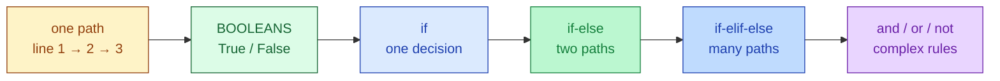

# Session 2.2 — Pre-Class Notes

> **Read this before the live class.**

---

## What you'll do in class

- Ask the computer **True/False** questions using `==`, `!=`, `<`, `>`, `<=`, `>=`
- Use **`if`**, **`else`**, **`elif`** to make your code branch
- Combine rules with **`and`**, **`or`**, **`not`**
- Get comfortable with **indentation** — Python's way of grouping code

### 🗺️ Today's journey



<details>
<summary>👀 <b>30-second sneak peek</b> — click to see what these will look like in code</summary>

```python
# A computer asking a question
age = 20
print(age >= 18)             # True

# The simplest decision
if age >= 18:
    print("You can vote.")

# The fork in the road
if age >= 18:
    print("You can vote.")
else:
    print("Too young to vote.")

# Multiple choices
if age < 12:
    print("Child")
elif age < 18:
    print("Teen")
else:
    print("Adult")
```

Don't memorise — just notice the *shape*. Every decision starts with `if`, ends with `:`, and the action lines are pushed to the right.

</details>

---

## Two questions to think about

Don't search — bring your **guesses** to class.

1. A self-driving car approaches a traffic light. Without ever using `if`, can you write code that tells the car what to do at red, yellow, and green? (Try in your head — what would you write?)
2. Why do you think Python uses **indentation** (pushing code to the right) to group lines? What's the alternative — and what could go wrong with it?

---

## Setup

Open a fresh Colab notebook called `s2-2-control-flow.ipynb` before class. (If you missed 2.1, run `print(5 == 5)` in a cell to confirm Python works — that should print `True`.)

---

## A small reminder before we start

Confusion is still the job. Bring the three biggest "wait, what?" moments from Session 2.1 — we'll clear them at the start.

---

See you in class 🚀
