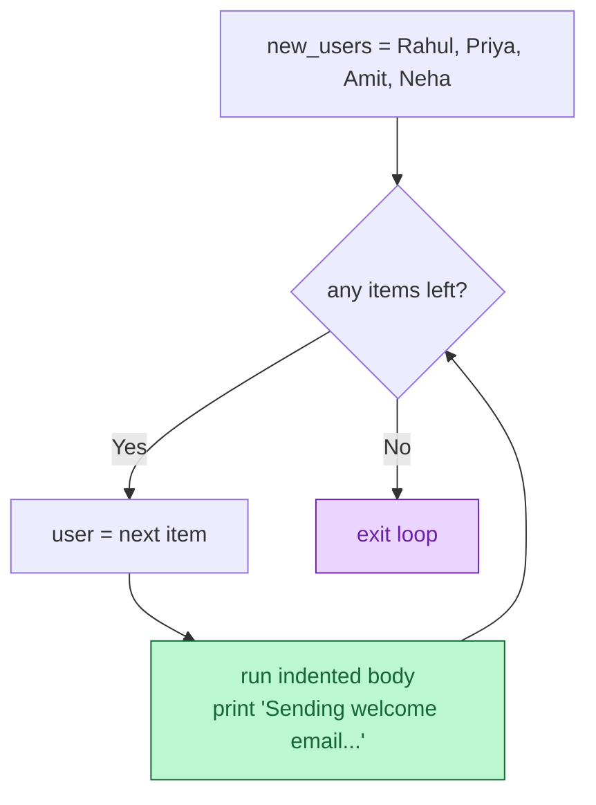
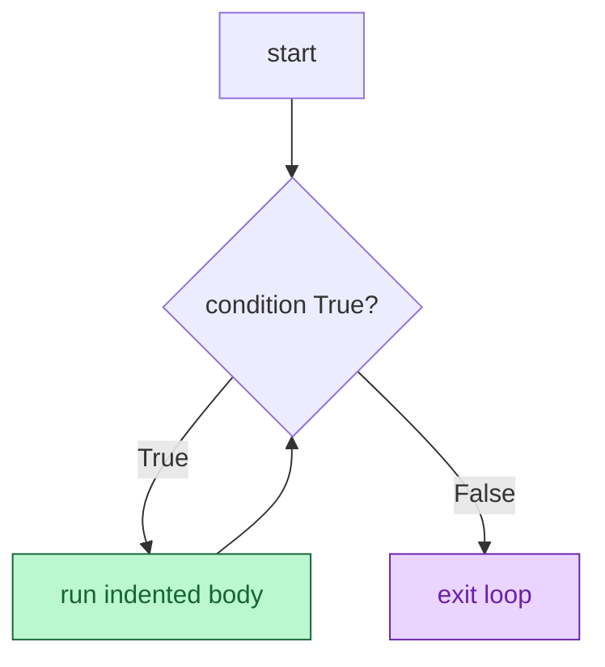
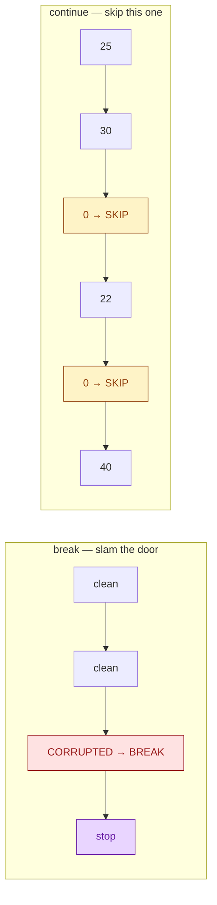

# Session 3.1 — Live Class

> **Module 1:** Python Programming Fundamentals and Flow Control
> **Title:** Iteration and Loop Mastery

---

## 🗺️ Today's journey

```mermaid
flowchart LR
    A["one value<br/>(2.2 if/else)"] --> B["FOR<br/>walk every item"]
    B --> C["range()<br/>number sequences"]
    C --> D["dict loops<br/>.items()"]
    D --> E["WHILE<br/>repeat until..."]
    E --> F["break / continue<br/>steer the loop"]
    F --> G["loop + if<br/>real programs"]
    style A fill:#fef3c7,stroke:#92400e,color:#92400e
    style B fill:#dcfce7,stroke:#166534,color:#166534
    style C fill:#dbeafe,stroke:#1e40af,color:#1e40af
    style D fill:#bbf7d0,stroke:#15803d,color:#15803d
    style E fill:#bfdbfe,stroke:#1e40af,color:#1e40af
    style F fill:#fed7aa,stroke:#9a3412,color:#9a3412
    style G fill:#e9d5ff,stroke:#6b21a8,color:#6b21a8
```



We'll move left to right. Each block builds on the one before — look back here any time to see where we are.

---

## Why your code needs to repeat — the 10,000 emails

Imagine you work for Netflix. **10,000 new users** just signed up, and your boss asks you to send a personalised welcome email to every single one of them. How long would it take you to copy, paste, and send 10,000 emails by hand?

Days. Weeks. You'd quit halfway through.

A programmer can do it in **three lines of code**, and the computer finishes in 0.2 seconds.

> **Today, we teach your code to do the work for you.**

In AI/ML you never deal with one piece of data. You train on 100,000 images. You process 50,000 rows of text. You run simulations 1,000 times. If you can't tell the computer *"do this for every item in this massive pile"*, you cannot build AI.

A loop is a tiny machine that says *"do this same thing for every item I give you."* Write the rule **once**. Python applies it to 10 items or 10 million — same code.

---

## The `for` loop — walk every item

The `for` loop is for **"for each item in this collection, do this thing"**.

**Analogy — the assembly line.** A box of raw materials comes down the belt. A robotic arm picks up the first item, paints it, puts it down. Then the next. Same action, every item, until the box is empty.

```python
new_users = ["Rahul", "Priya", "Amit", "Neha"]

print("--- STARTING EMAIL SYSTEM ---")

for user in new_users:
    print(f"Sending welcome email to: {user}")

print("--- ALL EMAILS SENT ---")
```

Output:
```
--- STARTING EMAIL SYSTEM ---
Sending welcome email to: Rahul
Sending welcome email to: Priya
Sending welcome email to: Amit
Sending welcome email to: Neha
--- ALL EMAILS SENT ---
```

### The four pieces of a `for` loop

```python
for user in new_users:                # ← keyword + variable + 'in' + collection + colon
    print(f"Sending welcome email to: {user}")  # ← indented body
```

1. **The keyword** — `for`.
2. **The loop variable** — `user`. A *fresh name* that Python automatically refills on each pass. (You pick the name; `user` is descriptive here.)
3. **`in <collection>`** — the bag of items to walk through.
4. **The colon `:` + indentation** — same shape as `if`. Indented lines are the body that runs **once per item**.

### How Python reads it



> 💡 **The variable refills automatically.** You never wrote `user = "Rahul"` then `user = "Priya"` — Python did it for you, one item at a time.

### Loops work on anything iterable

```python
for char in "hello":              # strings — one character at a time
    print(char)

for n in (10, 20, 30):            # tuples
    print(n)

for prime in {2, 3, 5, 7}:        # sets — order not guaranteed
    print(prime)
```

### A real one — apply 10% tax to a price list

```python
prices = [100, 200, 300]

for price in prices:
    new_price = price * 1.1
    print(f"₹{price} → ₹{new_price}")
```

Three lines do what would have been three copy-pasted blocks.

---

## `range()` — generating numbers

Often you don't have a list — you just want to repeat *N times* or count from A to B. That's `range()`.

```python
print("--- COUNTING ---")
for number in range(5):
    print(f"Processing item {number}")
```

Output:
```
--- COUNTING ---
Processing item 0
Processing item 1
Processing item 2
Processing item 3
Processing item 4
```

> 💡 **Why did it stop at 4?** Python is **zero-indexed**. `range(5)` produces 5 numbers — `0, 1, 2, 3, 4`. It starts at 0 and **stops *before* 5.** This off-by-one rule trips everyone once. Now you know.

### Three forms of `range()`

```python
range(5)         # 0, 1, 2, 3, 4
range(2, 6)      # 2, 3, 4, 5         (start, stop)
range(0, 10, 2)  # 0, 2, 4, 6, 8      (start, stop, step)
```

### Looping a fixed number of times

```python
for i in range(3):
    print("Warning!")
```

### Looping with the index *and* the value

```python
new_users = ["Rahul", "Priya", "Amit", "Neha"]
for i in range(len(new_users)):
    print(i, new_users[i])
```

There's a cleaner way — `enumerate()` — but `range(len(...))` works fine for now.

---

## Looping over dicts — unlocking key/value pairs

Dicts have **keys** and **values**. Looping over them needs a special technique — you tell Python *which part* you want to walk over.

```python
salaries = {
    "Rahul": 50000,
    "Priya": 75000,
    "Amit": 45000,
}

# Use .items() to grab BOTH the key and the value
print("--- SALARY REPORT ---")
for name, amount in salaries.items():
    print(f"{name} earns ₹{amount}")
```

`.items()` gives you each key/value as a pair. The two variable names on the left (`name`, `amount`) get filled in automatically — same idea as `for user in new_users`, just with two variables.

### Three ways to walk a dict

```python
# Keys only (the default)
for name in salaries:
    print(name)

# Values only
for amount in salaries.values():
    print(amount)

# Both at once — the most useful one
for name, amount in salaries.items():
    print(f"{name} → ₹{amount}")
```

### Combining with `if` — flagging models for production

```python
models = {"Model_A": 88, "Model_B": 95, "Model_C": 72}

for model, accuracy in models.items():
    if accuracy > 90:
        print(f"{model} is ready for production.")
```

Output:
```
Model_B is ready for production.
```

This is real ML code: walk a dict of models, decide which ones ship.

---

## The `while` loop — repeat until a condition flips

`for` is for "I know how many things". `while` is for **"keep going until something changes"**.

> 🚗 **Why we need it.** A self-driving car needs to *"keep driving while the road is clear."* It doesn't know how many seconds that will take. There's no list to walk — there's a condition to watch.

### Battery drain simulation

```python
battery = 100

print("--- DEVICE POWERED ON ---")

while battery > 80:
    print(f"Battery at {battery}%. System running.")
    battery = battery - 10        # MUST change the variable

print(f"Battery dropped to {battery}%. Entering power saving mode.")
```

Output:
```
--- DEVICE POWERED ON ---
Battery at 100%. System running.
Battery at 90%. System running.
Battery dropped to 80%. Entering power saving mode.
```

### The shape

```python
while <condition>:    # check the condition
    # body runs ONLY if condition is True
    # ...
    # change something so the condition can eventually become False
```

### How Python reads it



### ⚠️ The infinite-loop trap

```python
# ❌ Disaster — battery is never decreased
battery = 100
while battery > 80:
    print(f"Battery at {battery}%. System running.")
    # forgot to subtract!
```

This prints forever. In Colab: hit **Stop ⏹** (top-left of the cell) — *or* `Runtime → Interrupt execution`. In a terminal: `Ctrl+C`.

**The rule:** every `while` loop's body must change *something* the condition depends on. Otherwise the loop never ends.

### `for` vs. `while` — when to use each

| Use `for` when... | Use `while` when... |
|---|---|
| You have a collection to walk through | You don't know how many iterations |
| You want to repeat *N* times | You're waiting for a condition to flip |
| Sending 10,000 welcome emails | A car driving until the road is clear |
| Reading every row of a dataset | Polling a sensor until a value crosses a threshold |

In data work you'll write **10× more `for` loops than `while` loops**. Don't reach for `while` when `for` does the job.

---

## Steering the loop — `break` and `continue`

Sometimes mid-loop you want to **stop early** (`break`) or **skip just this one item** (`continue`).

### `break` — the emergency stop

A corrupted file is found mid-scan. Don't keep scanning — stop everything.

```python
files = ["clean", "clean", "CORRUPTED", "clean", "clean"]

for file in files:
    if file == "CORRUPTED":
        print("CRITICAL ERROR: Corrupted file found! Stopping the system.")
        break
    print(f"File {file} scanned successfully.")

print("Scan complete.")
```

Output:
```
File clean scanned successfully.
File clean scanned successfully.
CRITICAL ERROR: Corrupted file found! Stopping the system.
Scan complete.
```

The last two `clean` files never get scanned. The loop is done.

### `continue` — the skip button

Some user ages came in as `0` (missing data from a broken form). Skip them; process the rest.

```python
ages = [25, 30, 0, 22, 0, 40]

print("--- PROCESSING USERS ---")
for age in ages:
    if age == 0:
        print("Skipping missing data...")
        continue
    print(f"User is {age} years old. Saving to database.")
```

Output:
```
--- PROCESSING USERS ---
User is 25 years old. Saving to database.
User is 30 years old. Saving to database.
Skipping missing data...
User is 22 years old. Saving to database.
Skipping missing data...
User is 40 years old. Saving to database.
```

### Visual contrast



> 💡 **In one sentence:** `break` stops the entire loop forever. `continue` skips just *this one item* and moves to the next.

---

## The three classic loop patterns

Almost every real loop you'll ever write fits one of these three shapes. Memorise the shape, not specific code.

### Pattern 1 — Accumulator (running total)

```python
prices = [100, 200, 300]
total = 0
for price in prices:
    total = total + price       # build up a running sum
print("Total:", total)          # 600
```

A variable starts empty (`0` or `[]`) and **grows** with each pass.

### Pattern 2 — Counter (count things matching a rule)

```python
ages = [25, 30, 0, 22, 0, 40]
valid = 0
for age in ages:
    if age != 0:
        valid = valid + 1
print(f"{valid} valid users.")  # 4
```

A counter starts at `0` and **goes up** when the condition matches.

### Pattern 3 — Filter (build a new list of matches)

```python
models = {"Model_A": 88, "Model_B": 95, "Model_C": 72}
production_ready = []
for model, accuracy in models.items():
    if accuracy > 90:
        production_ready.append(model)
print(production_ready)         # ['Model_B']
```

Start with an empty list, **`.append()`** each match.

> 💡 You'll write these three shapes for the rest of your career. They cover 80% of all real data work.

---

## Nested loops — a loop inside a loop

You can put a `for` inside another `for`. The inner loop runs **completely** for *each* pass of the outer loop.

```python
sizes = ["S", "M", "L"]
colors = ["red", "blue"]

for size in sizes:
    for color in colors:
        print(f"{size} - {color}")
```

Output:
```
S - red
S - blue
M - red
M - blue
L - red
L - blue
```

**3 sizes × 2 colors = 6 lines.** Nested loops multiply.

> ⚠️ Nested loops are powerful but slow. A 1,000-item list inside a 1,000-item list is **1,000,000 iterations**. Use them deliberately.

---

## Capstone walkthrough — the Automated Data Cleaner

Putting it all together. We have a messy list of ages from a broken signup form. We have to:

- **Stop the whole pipeline** if we see hacker-injected code.
- **Skip** blank/missing entries.
- **Save** the clean entries to a new list.

```python
raw_ages = [24, 28, "blank", 35, 19, "HACKER_CODE", 42, 50]
clean_ages = []

print("=== STARTING DATA CLEANING PIPELINE ===")

for data in raw_ages:
    if data == "HACKER_CODE":
        print("🚨 SECURITY ALERT! Malicious code detected. Shutting down pipeline.")
        break

    if data == "blank":
        print("⚠️  Missing data found. Skipping.")
        continue

    print(f"✅ Clean data: Age {data}. Adding to clean list.")
    clean_ages.append(data)

print("\n=== PIPELINE FINISHED ===")
print(f"Final clean dataset: {clean_ages}")
```

Output:
```
=== STARTING DATA CLEANING PIPELINE ===
✅ Clean data: Age 24. Adding to clean list.
✅ Clean data: Age 28. Adding to clean list.
⚠️  Missing data found. Skipping.
✅ Clean data: Age 35. Adding to clean list.
✅ Clean data: Age 19. Adding to clean list.
🚨 SECURITY ALERT! Malicious code detected. Shutting down pipeline.

=== PIPELINE FINISHED ===
Final clean dataset: [24, 28, 35, 19]
```

This is real code. Every data pipeline at every company runs a smarter version of exactly this.

> ❓ **Think about it:** what would happen if you moved `clean_ages.append(data)` to the **top** of the loop, before the `if`s? Discuss. (Hint: `"HACKER_CODE"` and `"blank"` would end up in the clean list before you got a chance to check them.) **Order of operations inside a loop matters.**

---

## In-class practice

Three quick problems. Try first — solutions are in the post-class README.

### Problem 1 — Warning printer

Use a `for` loop with `range(3)` to print `"Warning!"` exactly three times.

### Problem 2 — Countdown timer

Use a `while` loop. Start with `timer = 3`. While `timer > 0`, print the timer value, then subtract 1. After the loop, print `"Liftoff!"`.

### Problem 3 — Production-ready models

Given:
```python
models = {"Model_A": 88, "Model_B": 95, "Model_C": 72, "Model_D": 91}
```

Loop over `.items()`. For each model with accuracy `> 90`, print `"<name> is ready for production."`. For everything else, print `"<name> needs more training."`.

> 💡 Problem 3 combines everything from today — a dict loop *with `.items()`*, a decision inside the loop, and an f-string output. This is what real data work looks like.

---

## Topics covered

Boxes get ticked as we work through them in the live class.

- [ ] The `for` loop — iterate over lists, tuples, strings, sets
- [ ] `range()` — generating number sequences (and the off-by-one rule)
- [ ] Looping over dicts with `.items()`
- [ ] The `while` loop — and how to avoid infinite loops
- [ ] `break` and `continue` — steering the loop
- [ ] The three classic patterns — accumulator, counter, filter
- [ ] Nested loops
- [ ] Combining loops with `if`/`else`

## Learning outcomes

By the end of this session you will have demonstrated:

- [ ] Automating repetitive tasks through iteration
- [ ] Managing complex data traversal using loops
- [ ] Choosing between `for` and `while` deliberately
- [ ] Avoiding the two scariest beginner errors (infinite loops, off-by-one)

---

## Code from this session

This folder will hold the `.py` files we built together during the live class.
**Files appear here AFTER the lecture is pushed** to GitHub.

If you're seeing this folder before class — that's expected. Bring your laptop;
we'll build everything from scratch together. The reference copy gets pushed
here so you have a clean version for revision.
