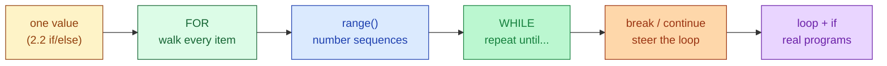
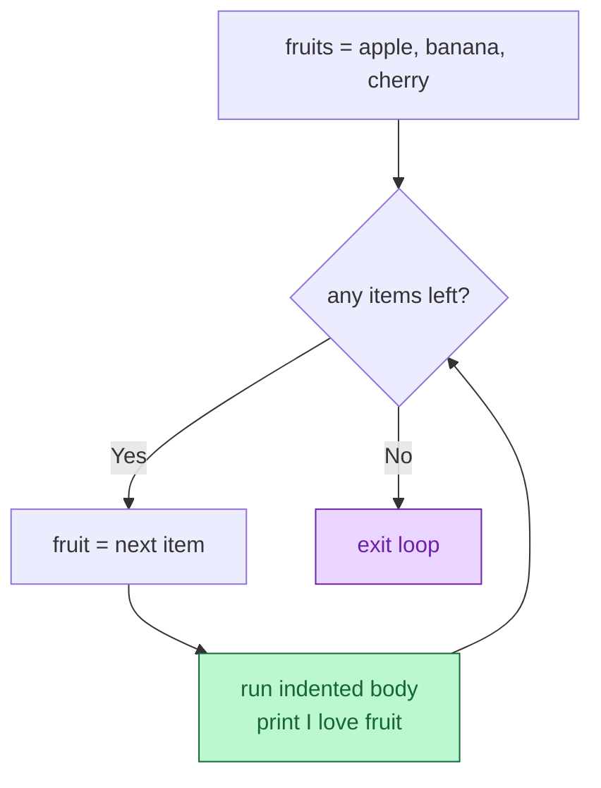
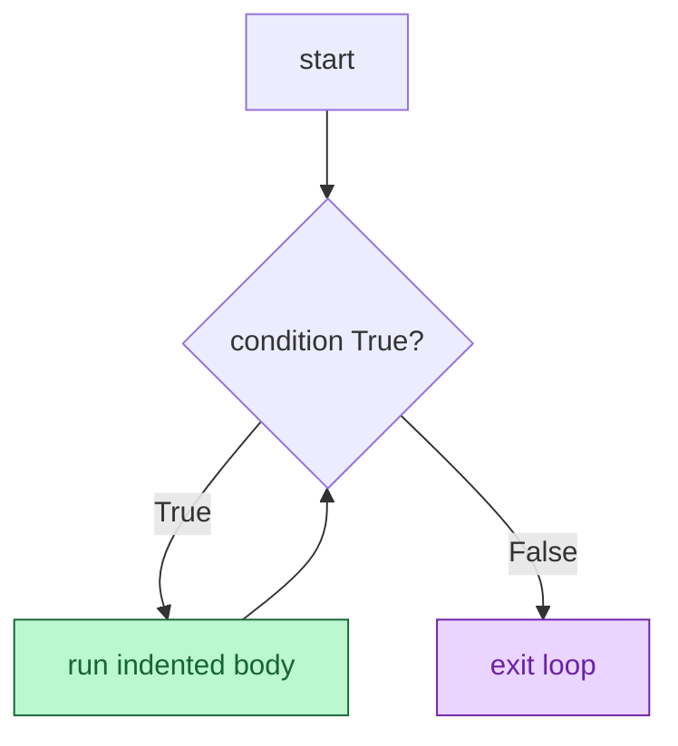
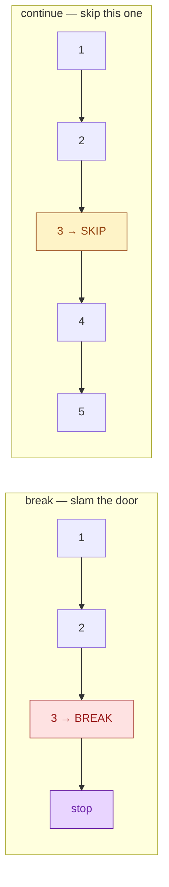

# Session 3.1 — Live Class

> **Module 1:** Python Programming Fundamentals and Flow Control
> **Title:** Iteration and Loop Mastery

---

## 🗺️ Today's journey



We'll move left to right. Each block builds on the one before — look back here any time to see where we are.

---

## Why your code needs to repeat

Imagine you're running an online exam. 1,000 students just finished. You have to print **"Passed"** for each score ≥ 50, and **"Failed"** otherwise.

Last class you'd have written this:

```python
score_1 = 72
if score_1 >= 50:
    print("Passed")
else:
    print("Failed")
```

…and copy-pasted it **999 more times**. Nobody does that. Nobody *can* do that.

> **Today, we teach your code to do the work for you.**

A loop is a tiny machine that says *"do this same thing for every item I give you."* You write the rule **once**. Python applies it to a list of 10 or 10 million — same code.

---

## The `for` loop — walk every item

The `for` loop is for **"for each item in this collection, do this thing"**.

```python
fruits = ["apple", "banana", "cherry"]

for fruit in fruits:
    print(f"I love {fruit}")
```

Output:
```
I love apple
I love banana
I love cherry
```

### The four pieces of a `for` loop

```python
for fruit in fruits:        # ← keyword + variable + 'in' + collection + colon
    print(f"I love {fruit}") # ← indented action (the body)
```

1. **The keyword** — `for`.
2. **The loop variable** — `fruit`. A *fresh name* that Python automatically refills on each pass. (You pick the name; `fruit` is descriptive here.)
3. **`in <collection>`** — the bag of items to walk through.
4. **The colon `:` + indentation** — same shape as `if`. Indented lines are the body that runs **once per item**.

### How Python reads it



> 💡 **The variable refills automatically.** You don't write `fruit = "apple"` then `fruit = "banana"` — Python does it for you, one item at a time.

### Loops work on anything you can iterate

```python
for char in "hello":          # strings — one character at a time
    print(char)

for n in (10, 20, 30):        # tuples
    print(n)

for prime in {2, 3, 5, 7}:    # sets — order not guaranteed
    print(prime)
```

---

## `range()` — generating numbers

Often you don't have a list — you just want to repeat *N times* or count from A to B. That's `range()`.

```python
for i in range(5):
    print(i)
```

Output:
```
0
1
2
3
4
```

> 💡 `range(5)` produces `0, 1, 2, 3, 4` — **five numbers, starting at 0, stopping *before* 5.** Python's "off-by-one" rule trips everyone once. Now you know.

### Three forms of `range()`

```python
range(5)         # 0, 1, 2, 3, 4
range(2, 6)      # 2, 3, 4, 5         (start, stop)
range(0, 10, 2)  # 0, 2, 4, 6, 8      (start, stop, step)
```

### Looping a fixed number of times

```python
for i in range(3):
    print("Attempt", i + 1)
```

### Looping with the index *and* the value

```python
fruits = ["apple", "banana", "cherry"]
for i in range(len(fruits)):
    print(i, fruits[i])
```

There's a cleaner way — `enumerate()` — but `range(len(...))` works fine for now.

---

## The `while` loop — repeat until a condition flips

`for` is for "I know how many things". `while` is for **"keep going until something changes"**.

```python
password = ""
attempts = 0

while password != "secret" and attempts < 3:
    password = input("Enter password: ")
    attempts = attempts + 1

print("Done.")
```

### The shape

```python
while <condition>:    # check the condition
    # body runs ONLY if condition is True
    # ...
    # change something so the condition can eventually become False
```

### How Python reads it



### ⚠️ The infinite-loop trap

```python
# ❌ Disaster — condition never becomes False
count = 0
while count < 5:
    print("Hello")
    # forgot to increase count!
```

This will print `Hello` forever. In Colab: hit **Stop ⏹** (top-left of the cell) — *or* `Runtime → Interrupt execution`. In a terminal: `Ctrl+C`.

**The rule:** every `while` loop's body must change *something* the condition depends on. Otherwise the loop never ends.

### `for` vs. `while` — when to use each

| Use `for` when... | Use `while` when... |
|---|---|
| You have a collection to walk through | You don't know how many iterations |
| You want to repeat *N* times | You're waiting for a condition to flip |
| Reading every row of a dataset | Polling a sensor until a value crosses a threshold |
| Processing every student in a class | Asking the user "y/n" until they give a valid answer |

In data work you'll write **10× more `for` loops than `while` loops**. Don't reach for `while` when `for` does the job.

---

## Steering the loop — `break` and `continue`

Sometimes mid-loop you want to **stop early** (`break`) or **skip just this one item** (`continue`).

### `break` — exit the loop immediately

```python
for n in [1, 2, 3, 4, 5]:
    if n == 3:
        break
    print(n)
```

Output:
```
1
2
```

The loop stops the moment `n == 3`. We never see 3, 4, or 5.

### `continue` — skip to the next item

```python
for n in [1, 2, 3, 4, 5]:
    if n == 3:
        continue
    print(n)
```

Output:
```
1
2
4
5
```

We *skip printing* `3` but the loop keeps going.

### Visual contrast



> 💡 **Tip:** if you're searching for a single item ("does this list contain 42?"), `break` is your friend — stop as soon as you find it. Don't keep scanning.

---

## The three classic loop patterns

Almost every real loop you'll ever write fits one of these three shapes. Memorise the shape, not specific code.

### Pattern 1 — Accumulator (running total)

```python
prices = [120, 80, 200, 50]
total = 0
for price in prices:
    total = total + price       # build up a running sum
print("Total:", total)
```

A variable starts empty (`0` or `[]`) and **grows** with each pass.

### Pattern 2 — Counter (count things matching a rule)

```python
scores = [72, 45, 90, 30, 65]
passed = 0
for s in scores:
    if s >= 50:
        passed = passed + 1
print(f"{passed} students passed.")
```

A counter starts at `0` and **goes up** when the condition matches.

### Pattern 3 — Filter (build a new list of matches)

```python
scores = [72, 45, 90, 30, 65]
top_scores = []
for s in scores:
    if s >= 80:
        top_scores.append(s)
print(top_scores)               # [90]
```

Start with an empty list, **`.append()`** each match.

> 💡 You'll write these three shapes for the rest of your career. They never get old, and they cover 80% of all real data work.

---

## Looping over dicts

Dicts have **keys** and **values** — Python gives you three ways to walk them.

```python
prices = {"milk": 60, "bread": 40, "eggs": 90}

# Keys only (the default)
for item in prices:
    print(item)

# Values only
for price in prices.values():
    print(price)

# Both at once — the most useful one
for item, price in prices.items():
    print(f"{item} costs ₹{price}")
```

`.items()` gives you each key/value as a pair. The two variable names on the left get filled in automatically — same idea as `for fruit in fruits`, just with two variables.

---

## Nested loops — a loop inside a loop

You can put a `for` inside another `for`. The inner loop runs **completely** for *each* pass of the outer loop.

```python
sizes = ["S", "M", "L"]
colors = ["red", "blue"]

for size in sizes:
    for color in colors:
        print(f"{size} - {color}")
```

Output:
```
S - red
S - blue
M - red
M - blue
L - red
L - blue
```

**3 sizes × 2 colors = 6 lines.** Nested loops multiply.

> ⚠️ Nested loops are powerful but slow. A 1,000-item list inside a 1,000-item list is **1,000,000 iterations**. Use them deliberately.

---

## Combining loops with `if`/`else`

This is where it all comes together. Loops give you the *"do this for every item"*, `if`/`else` gives you the *"but make a decision per item"*.

### Grading a class

```python
scores = [72, 45, 90, 30, 65, 88, 51]

for s in scores:
    if s >= 80:
        print(f"{s} — Distinction")
    elif s >= 50:
        print(f"{s} — Pass")
    else:
        print(f"{s} — Fail")
```

### Counting how many people are in each bucket

```python
scores = [72, 45, 90, 30, 65, 88, 51]
distinctions = 0
passes = 0
fails = 0

for s in scores:
    if s >= 80:
        distinctions = distinctions + 1
    elif s >= 50:
        passes = passes + 1
    else:
        fails = fails + 1

print(f"Distinctions: {distinctions}, Passes: {passes}, Fails: {fails}")
```

This is real code. Banks, schools, e-commerce sites — they all just run smarter versions of this.

---

## In-class practice

Three quick problems. Try first — solutions are in the post-class README.

### Problem 1 — Print 1 to 10

Use a `for` loop and `range()` to print the numbers `1` through `10` (inclusive). *Watch the off-by-one trap.*

### Problem 2 — Sum the even numbers

Given `nums = [1, 2, 3, 4, 5, 6, 7, 8, 9, 10]`, write a loop that adds **only the even numbers** and prints the total. (Hint: `n % 2 == 0` is `True` when `n` is even.)

### Problem 3 — The first password attempt

Use a `while` loop. Start with `password = ""`. Keep asking (use a fixed list of guesses like `["1234", "qwerty", "secret", "letmein"]` and an index variable) **until** the guess is `"secret"`, OR you've tried 3 times. Print `"Access granted"` or `"Locked out"`.

> 💡 If problem 3 feels intimidating — that's good. `while` loops always feel weird the first time because you have to manage the exit condition yourself. We'll walk through it.

---

## Topics covered

Boxes get ticked as we work through them in the live class.

- [ ] The `for` loop — iterate over lists, tuples, strings, sets
- [ ] `range()` — generating number sequences (and the off-by-one rule)
- [ ] The `while` loop — and how to avoid infinite loops
- [ ] `break` and `continue` — steering the loop
- [ ] The three classic patterns — accumulator, counter, filter
- [ ] Looping over dicts with `.items()`
- [ ] Nested loops
- [ ] Combining loops with `if`/`else`

## Learning outcomes

By the end of this session you will have demonstrated:

- [ ] Automating repetitive tasks through iteration
- [ ] Managing complex data traversal using loops
- [ ] Choosing between `for` and `while` deliberately
- [ ] Avoiding the two scariest beginner errors (infinite loops, off-by-one)

---

## Code from this session

This folder will hold the `.py` files we built together during the live class.
**Files appear here AFTER the lecture is pushed** to GitHub.

If you're seeing this folder before class — that's expected. Bring your laptop;
we'll build everything from scratch together. The reference copy gets pushed
here so you have a clean version for revision.
