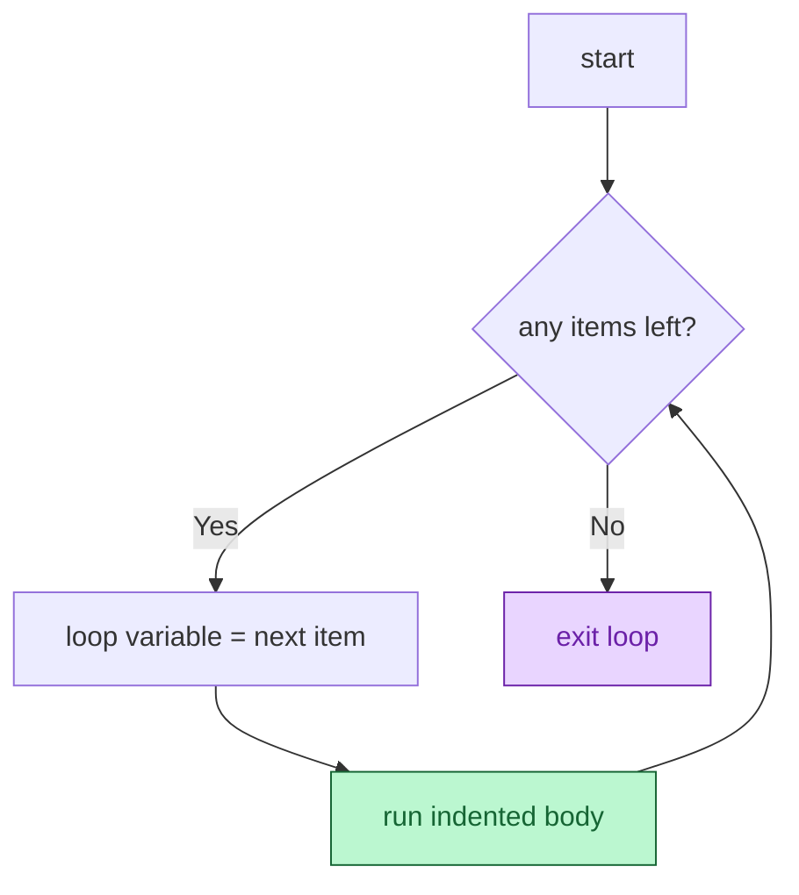

# Session 3.1 — Post-Class Assignments

> **Work through Set 1 + the mini-build.** Set 2 is bonus — try it if you want extra practice.
> **Tools:** Google Colab. One new notebook called `s3-1-homework.ipynb`.

---

## How to do these problems

1. Open Colab → New notebook → name it `s3-1-homework.ipynb`.
2. For **each problem**, create a new code cell.
3. **Try without peeking at the solutions** at the bottom. Sit with the problem before scrolling — confusion is the job.
4. If a problem feels impossible, write down *what you tried* and *where you got stuck*. Bring it to Session 3.2.
5. Save the notebook (auto-saves to your Google Drive).

---

## Set 1 — Drill (10 problems)

### 1. The basic `for` loop
Walk over the list `["Mumbai", "Delhi", "Bengaluru", "Chennai"]` and print each city with `"📍 "` in front of it.

### 2. `range()` and the off-by-one rule
Predict what each prints, then run:
```python
print(list(range(5)))
print(list(range(2, 6)))
print(list(range(0, 10, 3)))
```
*Why does `range(5)` stop at `4`?*

### 🔍 Visual cheat sheet — the for-loop flow (use this for Q3–Q6)



> 💡 The loop variable refills automatically on every pass. You never assign it yourself.

### 3. Sum 1 to 100
Use a `for` loop + `range()` to add the numbers from 1 to 100 (inclusive). Print the total.

### 4. Count the vowels
Given `word = "encyclopedia"`, count how many vowels (`a`, `e`, `i`, `o`, `u`) it contains. Print the count.

### 5. Filter a list
Given `nums = [12, 5, 28, 31, 7, 44, 9]`, build a new list `evens` containing **only the even numbers** and print it.

### 6. Multiplication table
Use a `for` loop to print the 7 times table from `7 × 1 = 7` to `7 × 10 = 70`. Use f-strings.

### 7. Loop over a dict
Given:
```python
prices = {"milk": 60, "bread": 40, "eggs": 90, "butter": 150}
```
Print each item and its price in the format `"milk costs ₹60"` using `.items()`.

> 🎬 **One-click visualizer:** [open this loop in Python Tutor](https://pythontutor.com/visualize.html#code=prices%20%3D%20%7B%22milk%22%3A%2060%2C%20%22bread%22%3A%2040%2C%20%22eggs%22%3A%2090%7D%0A%0Afor%20item%2C%20price%20in%20prices.items%28%29%3A%0A%20%20%20%20print%28f%22%7Bitem%7D%20costs%20%E2%82%B9%7Bprice%7D%22%29&mode=edit&py=3) — click **Visualize Execution** and step through to *see* the loop variables refill on each pass.

### 8. The `while` countdown
Use a `while` loop to print numbers from `10` down to `1`, then print `"Liftoff!"`. (Hint: start with `n = 10`, decrease it inside the loop.)

### 9. `break` early
Loop over `nums = [4, 11, 7, 8, 15, 2, 9]`. Print each number until you hit one **greater than 10**, then `break`. The number that triggered the break should **not** be printed.

### 10. `continue` to skip
Loop over `range(1, 11)`. Skip the number `5` using `continue`. Print everything else.

---

## Set 2 — Bonus (5 problems)

### 11. Nested loops — a multiplication table
Print the full multiplication table from `1×1` to `5×5`. Each row should be on a separate line:
```
1 x 1 = 1
1 x 2 = 2
...
5 x 5 = 25
```
(Hint: outer loop for the first number, inner loop for the second.)

### 12. The three classic patterns side by side
Given `scores = [72, 45, 90, 30, 65, 88, 51, 99, 22]`:
- **Accumulator:** total of all scores.
- **Counter:** how many are `>= 50`.
- **Filter:** new list of scores `>= 80`.

Print all three results.

### 13. The infinite-loop trap (with a safety net)
Write a `while` loop that **looks** like it would run forever, but include a counter that breaks out after 5 iterations:
```python
count = 0
while True:
    print("Hello")
    count = count + 1
    if count == 5:
        break
```
Predict the output before running. Then try removing the `break` (be ready to hit Stop ⏹).

### 14. Word lengths
Given `sentence = "Python loops are surprisingly fun"`, split it into words and print each word with its length:
```
Python — 6
loops — 5
are — 3
...
```
(Hint: `sentence.split()` gives you a list of words.)

### 15. Spot the bugs
This code is supposed to print every fruit. Find and fix all bugs:
```python
fruits = ["apple", "banana", "cherry"]
for fruit fruits:
print(fruit)
```

<details>
<summary>💡 <b>Stuck on Q15?</b> Click for a hint about what to look for</summary>

Look for:
- A missing keyword in the `for` line
- A missing colon at the end of the `for` line
- Missing indentation under the loop

</details>

---

## Mini-Build — "Class Result Generator"

Build a small program that processes a class of exam scores end-to-end — the kind of script every school portal runs.

### Spec
1. Define the data at the top of your cell:
   ```python
   students = {
       "Aanya": 78,
       "Rohan": 45,
       "Priya": 92,
       "Karan": 33,
       "Meera": 67,
       "Aditya": 88,
       "Sneha": 51,
   }
   ```
2. Loop over `students.items()`. For each student:
   - `score >= 80` → print `"Aanya: 78 — Pass"` style with grade `"A"`
   - `60 <= score < 80` → grade `"B"`
   - `50 <= score < 60` → grade `"C"`
   - `score < 50` → grade `"F"`
3. **After the loop** print three summary lines using counters:
   - Class size
   - Number of students who passed (`score >= 50`)
   - Class average (use an accumulator)

### Constraints
- Use **at least one** `for` loop, **one** `if`/`elif`/`else`, and **f-strings**.
- Use **three counters/accumulators** (pass count, total scores, class size).
- Keep it under 25 lines of code.

---

## Bonus Mini-Build — "Login Gatekeeper" (optional)

> 🟡 **Optional.** A taste of `while` + `break` powering real auth flows.

### The problem

Build a program that asks the user for a password up to 3 times, then either grants access or locks them out — the same logic ATMs and login screens run.

### Spec
1. Set:
   ```python
   real_password = "openSesame"
   guesses = ["password", "12345", "openSesame"]   # pretend user inputs
   ```
2. Use a `while` loop with a counter `attempt = 0`. On each pass:
   - Pick the next guess from `guesses` using `attempt` as the index.
   - If the guess matches `real_password` → print `"✅ Access granted"` and `break`.
   - Else → print `f"❌ Wrong (attempt {attempt + 1} of 3)"` and increment `attempt`.
3. After the loop: if `attempt == 3` and no break happened, print `"🔒 Locked out — too many attempts."`. (Hint: use a `while-else` or a flag variable.)

### Constraints
- Use a `while` loop with a clear exit condition.
- Use `break` for the success case.
- Track failed attempts with a counter.

<details>
<summary>💡 <b>Stuck on a step?</b> Click for graduated hints</summary>

- **The exit condition:** `while attempt < 3:` is the cleanest.
- **Picking the next guess:** `current_guess = guesses[attempt]` — `attempt` doubles as the index.
- **Tracking success:** set a `granted = False` before the loop; flip it to `True` inside the success branch right before `break`. After the loop, check `if not granted: print(...)`.

</details>

---

## 🛠️ Stuck? Visualise it

Loops are the first thing in Python where *seeing* the variable change on each pass really helps. Use these.

| Tool | What it's for |
|------|----------------|
| 🔍 [**Python Tutor**](https://pythontutor.com/visualize.html#mode=edit) | Paste your loop, hit "Visualize Execution", step through one iteration at a time. You'll *see* the loop variable refill on every pass — the magic becomes obvious. |
| 📖 [**Python docs — `for`/`while` statements**](https://docs.python.org/3/tutorial/controlflow.html#for-statements) | Official reference for loops. |
| 📋 [**Python docs — `range()`**](https://docs.python.org/3/library/functions.html#func-range) | Detailed rules for `range(start, stop, step)`. |
| 📚 [**W3Schools — Python for loops**](https://www.w3schools.com/python/python_for_loops.asp) | Beginner cheatsheet — fast lookup with examples. |
| 📚 [**W3Schools — Python while loops**](https://www.w3schools.com/python/python_while_loops.asp) | Counterpart for `while`. |

> **Try this in Python Tutor:** paste any of the loop problems into [pythontutor.com/visualize.html](https://pythontutor.com/visualize.html#mode=edit), step through one iteration at a time, and watch the loop variable refill. The "is Python really doing this for every item?" feeling vanishes after one visualisation.

---

## Reflection — write in a markdown cell

1. **What clicked today?** One thing that made sense quickly.
2. **What's still fuzzy?** One thing you'd want me to re-explain in 3.2. Be specific.
3. **`for` vs. `while` — in your own words:** when do you reach for each? Try one sentence per keyword.

---

## Preview — Session 3.2

**Title:** Functional Programming for Reusability

You can now loop over 1,000 students and grade each one. But what if you need that *same* grading logic in 12 different places in your code? You don't copy-paste the loop 12 times — you wrap it into a **function** and call it by name. Next class: `def`, parameters, `return`. This is where your scripts stop being scripts and start being **software**.

---

<details>
<summary><b>Solutions — try first, then peek</b></summary>

### Set 1

```python
# 1
cities = ["Mumbai", "Delhi", "Bengaluru", "Chennai"]
for city in cities:
    print(f"📍 {city}")

# 2
# range(5)         → [0, 1, 2, 3, 4]   stops BEFORE 5
# range(2, 6)      → [2, 3, 4, 5]
# range(0, 10, 3)  → [0, 3, 6, 9]

# 3
total = 0
for n in range(1, 101):       # stop is exclusive — use 101
    total = total + n
print(total)                  # 5050

# 4
word = "encyclopedia"
vowels = "aeiou"
count = 0
for ch in word:
    if ch in vowels:
        count = count + 1
print(count)                  # 6

# 5
nums = [12, 5, 28, 31, 7, 44, 9]
evens = []
for n in nums:
    if n % 2 == 0:
        evens.append(n)
print(evens)                  # [12, 28, 44]

# 6
for i in range(1, 11):
    print(f"7 x {i} = {7 * i}")

# 7
prices = {"milk": 60, "bread": 40, "eggs": 90, "butter": 150}
for item, price in prices.items():
    print(f"{item} costs ₹{price}")

# 8
n = 10
while n >= 1:
    print(n)
    n = n - 1
print("Liftoff!")

# 9
nums = [4, 11, 7, 8, 15, 2, 9]
for n in nums:
    if n > 10:
        break
    print(n)                  # 4

# 10
for n in range(1, 11):
    if n == 5:
        continue
    print(n)                  # 1 2 3 4 6 7 8 9 10
```

### Set 2

```python
# 11
for i in range(1, 6):
    for j in range(1, 6):
        print(f"{i} x {j} = {i * j}")

# 12
scores = [72, 45, 90, 30, 65, 88, 51, 99, 22]
total = 0
passed = 0
top = []
for s in scores:
    total = total + s
    if s >= 50:
        passed = passed + 1
    if s >= 80:
        top.append(s)
print("Sum:", total)          # 560
print("Passed:", passed)      # 6
print("Top:", top)            # [90, 88, 99]

# 13
# Predicted: prints "Hello" 5 times, then exits.
# Without the break: infinite — hit Stop ⏹.

# 14
sentence = "Python loops are surprisingly fun"
for word in sentence.split():
    print(f"{word} — {len(word)}")

# 15 — Fixed version
fruits = ["apple", "banana", "cherry"]
for fruit in fruits:          # was: for fruit fruits  (missing 'in', missing ':')
    print(fruit)              # was: not indented
```

### Mini-Build — Class Result Generator

```python
students = {
    "Aanya": 78, "Rohan": 45, "Priya": 92, "Karan": 33,
    "Meera": 67, "Aditya": 88, "Sneha": 51,
}

total = 0
passed = 0
class_size = 0

for name, score in students.items():
    class_size = class_size + 1
    total = total + score

    if score >= 80:
        grade = "A"
    elif score >= 60:
        grade = "B"
    elif score >= 50:
        grade = "C"
    else:
        grade = "F"

    if score >= 50:
        passed = passed + 1
        print(f"{name}: {score} — Pass (Grade {grade})")
    else:
        print(f"{name}: {score} — Fail (Grade {grade})")

print(f"\nClass size: {class_size}")
print(f"Passed:     {passed}")
print(f"Average:    {total / class_size:.1f}")
```

### Bonus Mini-Build — Login Gatekeeper

```python
real_password = "openSesame"
guesses = ["password", "12345", "openSesame"]
attempt = 0
granted = False

while attempt < 3:
    current_guess = guesses[attempt]
    if current_guess == real_password:
        print("✅ Access granted")
        granted = True
        break
    else:
        print(f"❌ Wrong (attempt {attempt + 1} of 3)")
        attempt = attempt + 1

if not granted:
    print("🔒 Locked out — too many attempts.")
```

</details>
