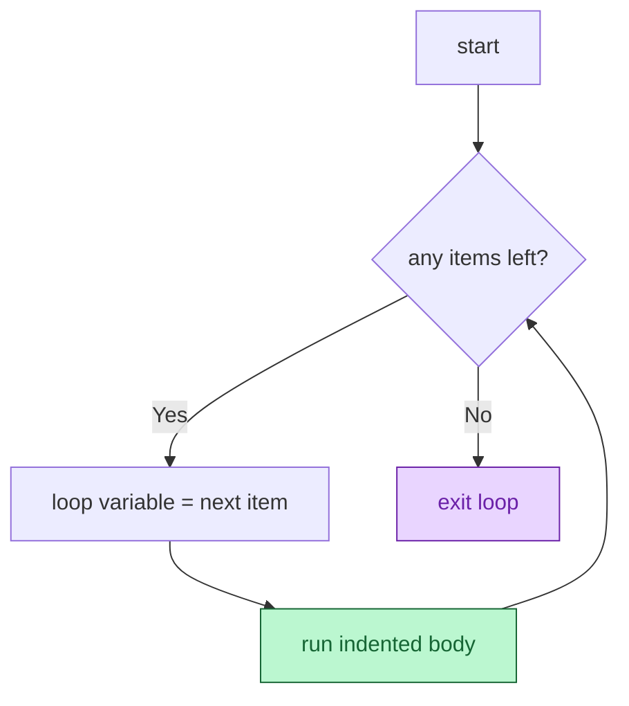

# Session 3.1 — Post-Class Assignments

> **Work through Set 1 + the mini-build.** Set 2 is bonus — try it if you want extra practice.
> **Tools:** Google Colab. One new notebook called `s3-1-homework.ipynb`.

---

## How to do these problems

1. Open Colab → New notebook → name it `s3-1-homework.ipynb`.
2. For **each problem**, create a new code cell.
3. **Try without peeking at the solutions** at the bottom. Sit with the problem before scrolling — confusion is the job.
4. If a problem feels impossible, write down *what you tried* and *where you got stuck*. Bring it to Session 3.2.
5. Save the notebook (auto-saves to your Google Drive).

---

## Set 1 — Drill (10 problems)

### 1. The welcome-email loop
Walk over the list `["Rahul", "Priya", "Amit", "Neha"]` and print `"Sending welcome email to: <name>"` for each.

### 2. `range()` and the off-by-one rule
Predict what each prints, then run:
```python
print(list(range(5)))
print(list(range(2, 6)))
print(list(range(0, 10, 3)))
```
*Why does `range(5)` stop at `4`?*

### 🔍 Visual cheat sheet — the for-loop flow (use this for Q3–Q6)



> 💡 The loop variable refills automatically on every pass. You never assign it yourself.

### 3. Apply 10% tax to a price list
Given `prices = [100, 200, 300]`, write a `for` loop that multiplies each price by `1.1` and prints `"₹100 → ₹110.0"`-style lines for each.

### 4. Sum 1 to 100
Use a `for` loop + `range()` to add the numbers from 1 to 100 (inclusive). Print the total.

### 5. Filter a list — valid ages only
Given `ages = [25, 30, 0, 22, 0, 40]`, build a new list `valid_ages` that contains only the non-zero entries and print it.

### 6. Repeat a warning
Use `for i in range(3):` to print `"Warning!"` exactly 3 times.

### 7. Loop over a dict — salary report
Given:
```python
salaries = {"Rahul": 50000, "Priya": 75000, "Amit": 45000}
```
Print each employee and their salary in the format `"Rahul earns ₹50000"` using `.items()`.

> 🎬 **One-click visualizer:** [open this loop in Python Tutor](https://pythontutor.com/visualize.html#code=salaries%20%3D%20%7B%22Rahul%22%3A%2050000%2C%20%22Priya%22%3A%2075000%2C%20%22Amit%22%3A%2045000%7D%0A%0Afor%20name%2C%20amount%20in%20salaries.items%28%29%3A%0A%20%20%20%20print%28f%22%7Bname%7D%20earns%20%E2%82%B9%7Bamount%7D%22%29&mode=edit&py=3) — click **Visualize Execution** and step through to *see* the loop variables refill on each pass.

### 8. The `while` countdown
Use a `while` loop to print numbers from `3` down to `1`, then print `"Liftoff!"`. (Hint: start with `timer = 3`, decrease inside the loop.)

### 9. `break` early — the corrupted file
Loop over `files = ["clean", "clean", "CORRUPTED", "clean", "clean"]`. Print each filename. If you hit `"CORRUPTED"`, print `"CRITICAL ERROR"` and `break` — the remaining files should **not** print.

### 10. `continue` to skip — missing user data
Loop over `ages = [25, 30, 0, 22, 0, 40]`. If `age == 0`, `continue` (skip). Otherwise print `"User is <age> years old."`.

---

## Set 2 — Bonus (5 problems)

### 11. Production-ready models
Given:
```python
models = {"Model_A": 88, "Model_B": 95, "Model_C": 72, "Model_D": 91}
```
Loop over `.items()`. For accuracy `> 90` print `"<name> is ready for production."`; for everything else print `"<name> needs more training."`.

### 12. The battery-drain simulation
Write a `while` loop. Start with `battery = 100`. While `battery > 80`, print `"Battery at <X>%. System running."`, then subtract `10`. After the loop, print `"Battery dropped to <X>%. Entering power saving mode."`.

### 13. The three classic patterns side by side
Given `salaries = {"Rahul": 50000, "Priya": 75000, "Amit": 45000, "Neha": 32000, "Vikram": 90000}`:
- **Accumulator:** total payroll cost.
- **Counter:** how many employees earn `≥ ₹50000`.
- **Filter:** new list of names earning `≥ ₹50000`.

Print all three results.

### 14. The infinite-loop trap (with a safety net)
Write a `while True:` loop that includes a counter that `break`s after 5 iterations:
```python
count = 0
while True:
    print("Hello")
    count = count + 1
    if count == 5:
        break
```
Predict the output before running. Then try removing the `break` (be ready to hit Stop ⏹).

### 15. Spot the bugs
This code is supposed to print every user. Find and fix all bugs:
```python
new_users = ["Rahul", "Priya", "Amit"]
for user new_users
print(user)
```

<details>
<summary>💡 <b>Stuck on Q15?</b> Click for a hint about what to look for</summary>

Look for:
- A missing keyword in the `for` line
- A missing colon at the end of the `for` line
- Missing indentation under the loop

</details>

---

## Mini-Build — "Automated Data Cleaner"

Take the live-class capstone and **own it**. Same pipeline, your version.

### Spec
1. Define the messy raw data at the top of your cell:
   ```python
   raw_ages = [24, 28, "blank", 35, 19, "HACKER_CODE", 42, 50]
   clean_ages = []
   ```
2. Loop over `raw_ages`. For each entry:
   - If it equals `"HACKER_CODE"` → print `"🚨 SECURITY ALERT! Shutting down."` and `break`.
   - If it equals `"blank"` → print `"⚠️  Missing data. Skipping."` and `continue`.
   - Otherwise → print `"✅ Clean data: Age <X>."` and **append** to `clean_ages`.
3. After the loop, print:
   - `"Final clean dataset: <list>"`
   - `"Total clean records: <count>"`
   - `"Average age: <average>"` (use a separate accumulator loop, or compute from `clean_ages`).

### Constraints
- Use **`break`** and **`continue`** **exactly once each**.
- Use **f-strings** in every output.
- Order matters — the `HACKER_CODE` check must come before any data is appended.
- Keep the whole solution under 25 lines.

> ❓ **Reflection:** What happens if you swap the order of the `break` and `continue` checks? Try it and explain (in a markdown cell) what changes.

---

## Bonus Mini-Build — "Login Gatekeeper" (optional)

> 🟡 **Optional.** A taste of `while` + `break` powering real auth flows.

### The problem

Build a program that gives a user **3 chances** to enter a password before locking them out — the same logic ATMs and login screens run.

### Spec
1. Set:
   ```python
   real_password = "openSesame"
   guesses = ["password", "12345", "openSesame"]   # pretend user inputs
   ```
2. Use a `while` loop with a counter `attempt = 0`. On each pass:
   - Pick the next guess from `guesses` using `attempt` as the index.
   - If the guess matches `real_password` → print `"✅ Access granted"` and `break`.
   - Else → print `f"❌ Wrong (attempt {attempt + 1} of 3)"` and increment `attempt`.
3. After the loop: if no `break` happened (use a flag variable), print `"🔒 Locked out — too many attempts."`.

### Constraints
- Use a `while` loop with a clear exit condition.
- Use `break` for the success case.
- Track failed attempts with a counter.

<details>
<summary>💡 <b>Stuck on a step?</b> Click for graduated hints</summary>

- **The exit condition:** `while attempt < 3:` is the cleanest.
- **Picking the next guess:** `current_guess = guesses[attempt]` — `attempt` doubles as the index.
- **Tracking success:** set a `granted = False` before the loop; flip it to `True` inside the success branch right before `break`. After the loop, check `if not granted: print(...)`.

</details>

---

## 🛠️ Stuck? Visualise it

Loops are the first thing in Python where *seeing* the variable change on each pass really helps. Use these.

| Tool | What it's for |
|------|----------------|
| 🔍 [**Python Tutor**](https://pythontutor.com/visualize.html#mode=edit) | Paste your loop, hit "Visualize Execution", step through one iteration at a time. You'll *see* the loop variable refill on every pass — the magic becomes obvious. |
| 📖 [**Python docs — `for`/`while` statements**](https://docs.python.org/3/tutorial/controlflow.html#for-statements) | Official reference for loops. |
| 📋 [**Python docs — `range()`**](https://docs.python.org/3/library/functions.html#func-range) | Detailed rules for `range(start, stop, step)`. |
| 📚 [**W3Schools — Python for loops**](https://www.w3schools.com/python/python_for_loops.asp) | Beginner cheatsheet — fast lookup with examples. |
| 📚 [**W3Schools — Python while loops**](https://www.w3schools.com/python/python_while_loops.asp) | Counterpart for `while`. |

> **Try this in Python Tutor:** paste any of the loop problems into [pythontutor.com/visualize.html](https://pythontutor.com/visualize.html#mode=edit), step through one iteration at a time, and watch the loop variable refill. The "is Python really doing this for every item?" feeling vanishes after one visualisation.

---

## Reflection — write in a markdown cell

1. **What clicked today?** One thing that made sense quickly.
2. **What's still fuzzy?** One thing you'd want me to re-explain in 3.2. Be specific.
3. **`for` vs. `while` — in your own words:** when do you reach for each? Try one sentence per keyword.

---

## Preview — Session 3.2

**Title:** Functional Programming for Reusability

You can now loop over 10,000 users and process each one. But what if you need that *same* loop or *same* `if`/`elif` in 12 different places in your code? You don't copy-paste — you wrap it into a **function** and call it by name. Next class: `def`, parameters, `return`. This is where your scripts stop being scripts and start being **software**.

---

<details>
<summary><b>Solutions — try first, then peek</b></summary>

### Set 1

```python
# 1
new_users = ["Rahul", "Priya", "Amit", "Neha"]
for user in new_users:
    print(f"Sending welcome email to: {user}")

# 2
# range(5)         → [0, 1, 2, 3, 4]   stops BEFORE 5
# range(2, 6)      → [2, 3, 4, 5]
# range(0, 10, 3)  → [0, 3, 6, 9]

# 3
prices = [100, 200, 300]
for price in prices:
    new_price = price * 1.1
    print(f"₹{price} → ₹{new_price}")

# 4
total = 0
for n in range(1, 101):       # stop is exclusive — use 101
    total = total + n
print(total)                  # 5050

# 5
ages = [25, 30, 0, 22, 0, 40]
valid_ages = []
for a in ages:
    if a != 0:
        valid_ages.append(a)
print(valid_ages)             # [25, 30, 22, 40]

# 6
for i in range(3):
    print("Warning!")

# 7
salaries = {"Rahul": 50000, "Priya": 75000, "Amit": 45000}
for name, amount in salaries.items():
    print(f"{name} earns ₹{amount}")

# 8
timer = 3
while timer > 0:
    print(timer)
    timer = timer - 1
print("Liftoff!")

# 9
files = ["clean", "clean", "CORRUPTED", "clean", "clean"]
for file in files:
    if file == "CORRUPTED":
        print("CRITICAL ERROR")
        break
    print(file)

# 10
for age in [25, 30, 0, 22, 0, 40]:
    if age == 0:
        continue
    print(f"User is {age} years old.")
```

### Set 2

```python
# 11
models = {"Model_A": 88, "Model_B": 95, "Model_C": 72, "Model_D": 91}
for model, accuracy in models.items():
    if accuracy > 90:
        print(f"{model} is ready for production.")
    else:
        print(f"{model} needs more training.")

# 12
battery = 100
while battery > 80:
    print(f"Battery at {battery}%. System running.")
    battery = battery - 10
print(f"Battery dropped to {battery}%. Entering power saving mode.")

# 13
salaries = {"Rahul": 50000, "Priya": 75000, "Amit": 45000, "Neha": 32000, "Vikram": 90000}
total = 0
high_earners = 0
top_names = []
for name, amount in salaries.items():
    total = total + amount
    if amount >= 50000:
        high_earners = high_earners + 1
        top_names.append(name)
print("Payroll total:", total)
print("High earners:", high_earners)
print("Top names:    ", top_names)

# 14
# Predicted: prints "Hello" 5 times, then exits.
# Without the break: infinite — hit Stop ⏹.

# 15 — Fixed version
new_users = ["Rahul", "Priya", "Amit"]
for user in new_users:         # was: for user new_users  (missing 'in', missing ':')
    print(user)                # was: not indented
```

### Mini-Build — Automated Data Cleaner

```python
raw_ages = [24, 28, "blank", 35, 19, "HACKER_CODE", 42, 50]
clean_ages = []

for data in raw_ages:
    if data == "HACKER_CODE":
        print("🚨 SECURITY ALERT! Shutting down.")
        break
    if data == "blank":
        print("⚠️  Missing data. Skipping.")
        continue
    print(f"✅ Clean data: Age {data}.")
    clean_ages.append(data)

total = 0
for age in clean_ages:
    total = total + age

print(f"\nFinal clean dataset: {clean_ages}")
print(f"Total clean records: {len(clean_ages)}")
if clean_ages:
    print(f"Average age: {total / len(clean_ages)}")
```

### Bonus Mini-Build — Login Gatekeeper

```python
real_password = "openSesame"
guesses = ["password", "12345", "openSesame"]
attempt = 0
granted = False

while attempt < 3:
    current_guess = guesses[attempt]
    if current_guess == real_password:
        print("✅ Access granted")
        granted = True
        break
    else:
        print(f"❌ Wrong (attempt {attempt + 1} of 3)")
        attempt = attempt + 1

if not granted:
    print("🔒 Locked out — too many attempts.")
```

</details>
