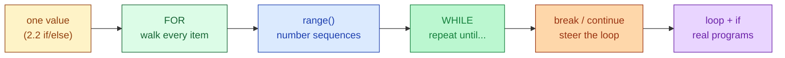

# Session 3.1 — Pre-Class Notes

> **Read this before the live class.**

---

## What you'll do in class

- Walk through every item in a collection with a **`for`** loop
- Generate sequences of numbers with **`range()`**
- Repeat *until a condition flips* with a **`while`** loop
- Skip an item with **`continue`** · stop early with **`break`**
- Wire loops together with the `if`/`else` you learned in 2.2

### 🗺️ Today's journey



<details>
<summary>👀 <b>30-second sneak peek</b> — click to see what these will look like in code</summary>

```python
# Walk every item
fruits = ["apple", "banana", "cherry"]
for fruit in fruits:
    print(fruit)

# Count from 0 to 4
for i in range(5):
    print(i)

# Repeat until a condition flips
attempts = 0
while attempts < 3:
    print("Trying...")
    attempts = attempts + 1

# Stop early
for n in [1, 2, 3, 4, 5]:
    if n == 3:
        break
    print(n)            # prints 1, 2 only

# Skip one item
for n in [1, 2, 3, 4, 5]:
    if n == 3:
        continue
    print(n)            # prints 1, 2, 4, 5
```

Don't memorise — just notice the *shape*. Every loop has a keyword (`for` / `while`), a colon `:`, and an **indented** body.

</details>

---

## Two questions to think about

Don't search — bring your **guesses** to class.

1. You have a list of 1,000 student scores. You want to print *"Passed"* for every score ≥ 50 and *"Failed"* otherwise. Without using a loop, how would you do this? (Honestly try — feel the pain of writing 1,000 `if` statements.)
2. A `while` loop keeps running as long as its condition is `True`. What's the worst thing that could happen if the condition **never** becomes `False`?

---

## Setup

Open a fresh Colab notebook called `s3-1-loops.ipynb` before class. Quick sanity-check cell:

```python
for i in range(3):
    print("Loop", i)
```

Expected output:
```
Loop 0
Loop 1
Loop 2
```

If that works, Colab is good to go.

---

## A small reminder before we start

You don't have to "get" loops on the first pass. The shape (`for ___ in ___:` + indented body) takes most people 2–3 reruns before it clicks. Bring your three biggest *"wait, what?"* moments from 2.2 — we'll clear them at the top.

---

See you in class 🚀
