# Session 3.1 — Pre-Class Notes

> **Read this before the live class.**

---

## What you'll do in class

- Walk through every item in a collection with a **`for`** loop
- Generate sequences of numbers with **`range()`**
- Loop over dicts using **`.items()`** to grab keys and values at once
- Repeat *until a condition flips* with a **`while`** loop
- Skip an item with **`continue`** · stop early with **`break`**
- Wire loops together with the `if`/`else` you learned in 2.2

### 🗺️ Today's journey

```mermaid
flowchart LR
    A["one value<br/>(2.2 if/else)"] --> B["FOR<br/>walk every item"]
    B --> C["range()<br/>number sequences"]
    C --> D["dict loops<br/>.items()"]
    D --> E["WHILE<br/>repeat until..."]
    E --> F["break / continue<br/>steer the loop"]
    F --> G["loop + if<br/>real programs"]
    style A fill:#fef3c7,stroke:#92400e,color:#92400e
    style B fill:#dcfce7,stroke:#166534,color:#166534
    style C fill:#dbeafe,stroke:#1e40af,color:#1e40af
    style D fill:#bbf7d0,stroke:#15803d,color:#15803d
    style E fill:#bfdbfe,stroke:#1e40af,color:#1e40af
    style F fill:#fed7aa,stroke:#9a3412,color:#9a3412
    style G fill:#e9d5ff,stroke:#6b21a8,color:#6b21a8
```



<details>
<summary>👀 <b>30-second sneak peek</b> — click to see what these will look like in code</summary>

```python
# Walk every item — send welcome emails to new users
new_users = ["Rahul", "Priya", "Amit", "Neha"]
for user in new_users:
    print(f"Sending welcome email to: {user}")

# Repeat N times — count from 0 to 4
for number in range(5):
    print(f"Processing item {number}")

# Walk a dict — pull keys and values together
salaries = {"Rahul": 50000, "Priya": 75000, "Amit": 45000}
for name, amount in salaries.items():
    print(f"{name} earns ₹{amount}")

# Repeat until a condition flips — battery drain
battery = 100
while battery > 80:
    print(f"Battery at {battery}%")
    battery = battery - 10

# Stop early — corrupted file
files = ["clean", "clean", "CORRUPTED", "clean"]
for file in files:
    if file == "CORRUPTED":
        break
    print(file)

# Skip one item — missing user age
for age in [25, 30, 0, 22, 0, 40]:
    if age == 0:
        continue
    print(age)
```

Don't memorise — just notice the *shape*. Every loop has a keyword (`for` / `while`), a colon `:`, and an **indented** body.

</details>

---

## Two questions to think about

Don't search — bring your **guesses** to class.

1. You work for Netflix. 10,000 new users just signed up and you have to send each one a personalised welcome email. **Without** using a loop, how would you do this? Honestly try — feel the pain.
2. A `while` loop keeps running as long as its condition is `True`. What's the worst thing that could happen if the condition **never** becomes `False`?

---

## Setup

Open a fresh Colab notebook called `s3-1-loops.ipynb` before class. Quick sanity-check cell:

```python
for i in range(3):
    print("Loop", i)
```

Expected output:
```
Loop 0
Loop 1
Loop 2
```

If that works, Colab is good to go.

---

## A small reminder before we start

You don't have to "get" loops on the first pass. The shape (`for ___ in ___:` + indented body) takes most people 2–3 reruns before it clicks. Bring your three biggest *"wait, what?"* moments from 2.2 — we'll clear them at the top.

---

See you in class 🚀
