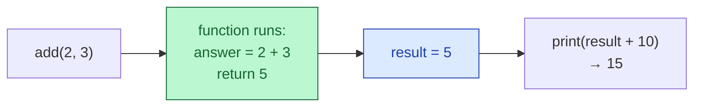
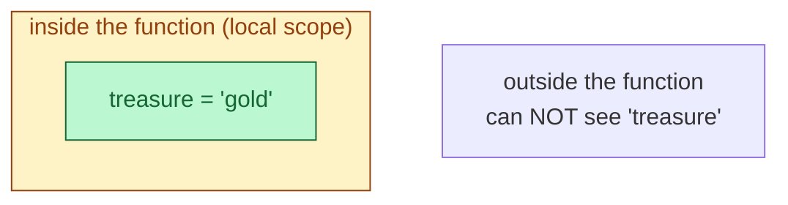

# Session 3.2 — Live Class

> **Module 1:** Python Programming Fundamentals and Flow Control
> **Title:** Functional Programming for Reusability

---

## 🗺️ Today's journey

```mermaid
flowchart LR
    A["copy-pasted<br/>code blocks"] --> B["DEF<br/>build the tool"]
    B --> C["CALL<br/>press the button"]
    C --> D["parameters<br/>feed data IN"]
    D --> E["return<br/>get data OUT"]
    E --> F["defaults +<br/>keyword args"]
    F --> G["scope<br/>the black box"]
    style A fill:#fef3c7,stroke:#92400e,color:#92400e
    style B fill:#dcfce7,stroke:#166534,color:#166534
    style C fill:#dbeafe,stroke:#1e40af,color:#1e40af
    style D fill:#bbf7d0,stroke:#15803d,color:#15803d
    style E fill:#bfdbfe,stroke:#1e40af,color:#1e40af
    style F fill:#fed7aa,stroke:#9a3412,color:#9a3412
    style G fill:#e9d5ff,stroke:#6b21a8,color:#6b21a8
```



We'll move left to right. Each block builds on the one before — look back here any time to see where we are.

---

## The coffee shop — why functions exist

Imagine you run a coffee shop. A customer orders a latte. Do you sit down with a textbook on coffee physics, look up how to grind beans, invent steamed milk from scratch?

No. You already have a **recipe** in your head. You execute it. Customer 2 orders a latte — same recipe. Customer 500 orders a latte — *same recipe*. You don't re-invent it 500 times.

That's a function.

> **Today, we teach you to bottle code into recipes.**

Up until now, every time you needed to grade a student, calculate a discount, or print a header — you wrote the code from scratch. If you need that same logic in 12 different files, you've copy-pasted it 12 times. Change one detail (say, the pass mark moves from 50 to 55) and you have to find and fix it in *all 12 places*.

A function says: **write the rule once, call it by name from anywhere.** Change the rule once → the change applies everywhere.

This is the single most important idea in programming. It even has a name: **DRY — Don't Repeat Yourself.**

---

## The two phases — define and call

Using a function is a **two-step** process:

1. **Define** it — write down the recipe. (The computer memorises it but does *nothing* yet.)
2. **Call** it — type its name to actually execute it.

```python
# Phase 1 — Define (computer memorises, runs nothing yet)
def greet_user():
    print("Welcome to the AI Dashboard!")

# Nothing has printed yet.

# Phase 2 — Call (now the recipe runs)
print("Starting up...")
greet_user()
print("Done.")
```

Output:
```
Starting up...
Welcome to the AI Dashboard!
Done.
```

> ⚠️ **The most common rookie mistake.** Writing `greet_user` (without `()`) does *nothing*. It just refers to the function object. You **must** add the parentheses to actually call it: `greet_user()`.

### The five pieces of a function definition

```python
def greet_user():       # ← def + name + () + colon
    print("Welcome!")    # ← indented body
```

1. **`def`** — the keyword that tells Python "I'm building a recipe".
2. **The name** — `greet_user`. Use lowercase with underscores (`snake_case`). Names should describe what the function *does*.
3. **`()`** — required, even if empty. This is where parameters will sit later.
4. **`:`** — the velvet rope. Same as `if`, `for`, `while`.
5. **The indented body** — what runs when the function is called.

---

## Parameters and arguments — feeding data in

`greet_user()` always says the same thing. To make it flexible we pass data in.

```python
def greet_user(name):                       # 'name' is the parameter (the empty slot)
    print(f"Welcome, {name}!")

greet_user("Aanya")                          # "Aanya" is the argument (the actual value)
greet_user("Rohan")
```

Output:
```
Welcome, Aanya!
Welcome, Rohan!
```

### Parameter vs. argument — the parking-spot analogy

> **Parameter** = the empty parking spot you drew in the function definition (`name`).
> **Argument** = the actual car you park there when you call (`"Aanya"`).

They're often confused — but they're different. Parameters live inside `def`. Arguments live inside the call.

### Multiple parameters

```python
def calculate_tax(amount, rate):
    return amount * rate

print(calculate_tax(1000, 0.18))             # 180.0
print(calculate_tax(50000, 0.05))            # 2500.0
```

**Order matters.** The first argument fills the first parameter, the second fills the second, and so on.

---

## The `return` statement — getting data out

So far our functions just `print`. That's fine for showing things to a human — but the rest of the program can't *use* it.

> 🍕 **Analogy.** If a chef *shows* you a pizza through a glass window, you can't eat it. The chef has to **hand it to you**. `print()` shows. `return` hands.

### The trap of `print()` inside a function

```python
# ❌ The print trap
def add_print(a, b):
    answer = a + b
    print(answer)            # shows the human, but...

result = add_print(2, 3)     # ...nothing is handed back
print(result + 10)           # TypeError — result is None!
```

`add_print` *displays* `5` on screen. But `result` is set to `None` — because nothing was `return`-ed. `None + 10` crashes.

### The fix — use `return`

```python
# ✅ The return way
def add(a, b):
    return a + b

result = add(2, 3)           # result is now 5 — captured
print(result + 10)           # 15 — we can keep computing
```



### ⚠️ Critical rule

> **In data science and AI, functions almost never `print`. They take raw data in, process it, and `return` clean data out.** Printing is for humans. Returning is for the next step of your program.

### `return` is also the exit door

The moment Python hits a `return`, the function **stops**. Any code after it never runs.

```python
def check_status():
    return "Complete!"
    print("This never prints.")   # dead code — unreachable
```

This trips people up exactly once. Now you know.

---

## Default values — sensible assumptions

Often a parameter takes the *same* value 99% of the time. (E.g. Indian tax rate is 18%.) Give it a default so the caller doesn't have to repeat it.

```python
def calculate_total(price, tax_rate=0.18):
    return price + price * tax_rate

print(calculate_total(100))             # 118.0 — used the default
print(calculate_total(100, 0.05))       # 105.0 — caller overrode
```

### One rule

**Defaults must come after non-defaults** in the parameter list.

```python
# ✅ OK
def f(a, b=5):     ...

# ❌ SyntaxError
def f(a=5, b):     ...
```

---

## Keyword arguments — call by name

You can also call a function by **naming** the arguments. This works whether the parameter has a default or not.

```python
def create_user(name, role="User", active=True):
    return f"{name} | {role} | active={active}"

print(create_user("Aanya"))
print(create_user("Rohan", role="Admin"))
print(create_user(name="Priya", active=False, role="Auditor"))   # any order
```

**Why bother?** Readability. `create_user("Priya", "Auditor", False)` makes you guess what `False` means. `create_user("Priya", role="Auditor", active=False)` reads itself.

---

## Scope — the black box

A function is a **mini-universe**. Variables created inside a function don't leak out. We call this **local scope**.

```python
def secret_room():
    treasure = "gold"
    print("Inside the function:", treasure)

secret_room()
print(treasure)        # ❌ NameError — treasure is gone
```



This is a **feature, not a bug**. It means:

- You can have a variable called `total` in 10 different functions, and they never interfere.
- Functions don't accidentally corrupt your main program's data.
- Each function is a clean, isolated machine.

### Globals can be *read* from inside

```python
greeting = "Hello"          # global

def say_it():
    print(greeting, "world")  # reads the global — OK

say_it()                      # Hello world
```

But trying to *modify* a global from inside a function is something we avoid in this course — it leads to surprise bugs. Pass data **in** as parameters; pass data **out** as `return`. That's the clean pattern.

---

## Functions + loops + `if`/`else` — the real picture

This is where everything from Module 1 comes together.

### Re-usable grader

```python
def grade(score):
    if score >= 80:
        return "A"
    elif score >= 60:
        return "B"
    elif score >= 50:
        return "C"
    else:
        return "F"

scores = [72, 45, 90, 30, 65]
for s in scores:
    print(s, "→", grade(s))
```

Notice — the `if`/`elif`/`else` from Session 2.2 lives inside the function. The `for` loop from Session 3.1 calls the function on each item. **You wrote `grade()` once. You can now call it from anywhere.**

### Function that takes a list, returns a list

```python
def passing_only(scores):
    result = []
    for s in scores:
        if s >= 50:
            result.append(s)
    return result

print(passing_only([72, 45, 90, 30, 65]))    # [72, 90, 65]
```

This is the **filter pattern from 3.1**, but now wrapped into a reusable tool. Hand it any list of scores; get back the passing ones. Forever.

### Functions calling functions

```python
def grade(score):
    if score >= 80:   return "A"
    elif score >= 60: return "B"
    elif score >= 50: return "C"
    else:             return "F"

def class_report(scores):
    for s in scores:
        print(f"{s} → {grade(s)}")     # calling one function from inside another

class_report([72, 45, 90, 30, 65])
```

**Functions calling functions** is how every real codebase is organised. Small tools, snapped together.

---

## In-class practice

Three quick problems. Try first — solutions are in the post-class README.

### Problem 1 — A function with no arguments

Write a function `motivate()` that prints `"Programming is a skill, not a talent."` Call it three times.

### Problem 2 — A function that returns

Write a function `area_of_rectangle(length, width)` that **returns** the area. Save the result into a variable and print it. (No `print` inside the function!)

### Problem 3 — A function with a default

Write a function `greet(name, language="English")` that:
- returns `"Hello, {name}!"` if `language == "English"`
- returns `"Namaste, {name}!"` if `language == "Hindi"`
- returns `"Hi, {name}!"` for anything else

Call it three times with three different language choices.

> 💡 If problem 3 felt mean — that's how every real API works. Sensible default, plus a way to override.

---

## Topics covered

Boxes get ticked as we work through them in the live class.

- [ ] Why DRY matters — copy-paste pain vs. reusable tools
- [ ] `def` — defining a function
- [ ] Calling a function (and the missing-parentheses trap)
- [ ] Parameters vs. arguments
- [ ] `return` — handing data back (and the `print`-vs-`return` distinction)
- [ ] Default values and keyword arguments
- [ ] Local scope — the black-box model
- [ ] Functions + loops + `if`/`else` — the real-world combination

## Learning outcomes

By the end of this session you will have demonstrated:

- [ ] Designing and using user-defined functions
- [ ] Writing clean and reusable code blocks
- [ ] Passing data in with parameters, getting data out with `return`
- [ ] Avoiding the three classic errors (missing `()`, `print` instead of `return`, code after `return`)

---

## Code from this session

This folder will hold the `.py` files we built together during the live class.
**Files appear here AFTER the lecture is pushed** to GitHub.

If you're seeing this folder before class — that's expected. Bring your laptop;
we'll build everything from scratch together. The reference copy gets pushed
here so you have a clean version for revision.
