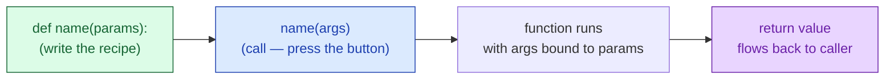

# Session 3.2 — Post-Class Assignments

> **Work through Set 1 + the mini-build.** Set 2 is bonus — try it if you want extra practice.
> **Tools:** Google Colab. One new notebook called `s3-2-homework.ipynb`.

---

## How to do these problems

1. Open Colab → New notebook → name it `s3-2-homework.ipynb`.
2. For **each problem**, create a new code cell.
3. **Try without peeking at the solutions** at the bottom. Sit with the problem before scrolling — confusion is the job.
4. If a problem feels impossible, write down *what you tried* and *where you got stuck*. Bring it to the next class.
5. Save the notebook (auto-saves to your Google Drive).

---

## Set 1 — Drill (10 problems)

### 1. The simplest function
Write a function `say_hello()` that prints `"Hello, world!"`. Call it twice.

### 2. The missing-parentheses trap
Predict what each prints, then run:
```python
def shout():
    print("HEY!")

print(shout)      # what is this?
shout             # what is this?
shout()           # what is this?
```
Why does only the third one actually print `HEY!`?

### 🔍 Visual cheat sheet — the function lifecycle (use this for Q3–Q7)



> 💡 Parameters are empty slots in the definition. Arguments are the actual values you pass when calling.

### 3. One parameter
Write `square(n)` that **returns** `n * n`. Print `square(6)` and `square(11)`.

### 4. Two parameters
Write `add(a, b)` that **returns** `a + b`. Save the result of `add(7, 8)` into a variable called `result` and print it.

### 5. Return vs print
Predict, then run:
```python
def double_print(n):
    print(n * 2)

def double_return(n):
    return n * 2

x = double_print(5)
y = double_return(5)

print("x is:", x)
print("y is:", y)
```
Explain (in a comment) why `x` is `None` but `y` is `10`.

### 6. Default value
Write `power(base, exponent=2)` that returns `base ** exponent`. Test:
- `power(5)` should be `25`
- `power(5, 3)` should be `125`

### 7. Keyword arguments
Given:
```python
def create_user(name, role="User", active=True):
    return f"{name} | {role} | active={active}"
```
Call it three ways:
- using only positional arguments
- using a mix (some positional, some keyword)
- using only keyword arguments — in **reversed** order

> 🎬 **One-click visualizer:** [open this in Python Tutor](https://pythontutor.com/visualize.html#code=def%20add%28a%2C%20b%29%3A%0A%20%20%20%20answer%20%3D%20a%20%2B%20b%0A%20%20%20%20return%20answer%0A%0Aresult%20%3D%20add%282%2C%203%29%0Aprint%28result%20%2B%2010%29&mode=edit&py=3) — click **Visualize Execution** and step through to *see* the function's local scope pop up and disappear.

### 8. Scope check
Predict what happens, then run:
```python
def make_secret():
    secret = "hidden"
    print("Inside:", secret)

make_secret()
print("Outside:", secret)
```
What error do you get? Why?

### 9. Function with a loop inside
Write `sum_of_list(numbers)` that takes a list and **returns** the total. (Use a `for` loop + accumulator.) Test with `sum_of_list([10, 20, 30, 40])`.

### 10. Function that returns a list
Write `evens_only(numbers)` that takes a list and **returns** a new list with only the even numbers. (Use a `for` loop + filter pattern.) Test with `evens_only([1, 2, 3, 4, 5, 6, 7, 8])`.

---

## Set 2 — Bonus (5 problems)

### 11. Function calling another function
Build two functions:
```python
def is_even(n):
    return n % 2 == 0

def count_evens(numbers):
    # use is_even() inside this function
    ...
```
`count_evens` should return how many numbers in the list are even. Test with `count_evens([1, 2, 3, 4, 5, 6])` → should be `3`.

### 12. Dead code after `return`
Predict, then run:
```python
def check():
    return "done"
    print("after return")

print(check())
```
Why doesn't `"after return"` ever print?

### 13. Grading function
Write `grade(score)` that returns:
- `"A"` if score `>= 80`
- `"B"` if score `>= 60`
- `"C"` if score `>= 50`
- `"F"` otherwise

Then loop over `[72, 45, 90, 30, 65, 88, 51]` and print each score with its grade. **The `if`/`elif`/`else` should live inside the function**, not in the loop.

### 14. Discount function with default
Write `apply_discount(price, percent=10)` that returns the price after subtracting the discount. Test:
- `apply_discount(1000)` → `900.0`
- `apply_discount(1000, 25)` → `750.0`
- `apply_discount(price=2000, percent=15)` → `1700.0`

### 15. Spot the bugs
This code has **three** bugs. Find and fix them all:
```python
def multiply(a, b)
    answer = a * b
    print(answer)

result = multiply 4, 5
print(result + 10)
```

<details>
<summary>💡 <b>Stuck on Q15?</b> Click for a hint about what to look for</summary>

Look for:
- A missing punctuation mark in the `def` line
- A missing pair of parentheses in the call
- `print` inside the function where `return` should be (which is why `result + 10` will crash)

</details>

---

## Mini-Build — "Reusable Class Grader"

Take Session 3.1's "Class Result Generator" and **refactor it with functions**. Same output, much cleaner code.

### Spec
1. Define the data at the top:
   ```python
   students = {
       "Aanya": 78, "Rohan": 45, "Priya": 92, "Karan": 33,
       "Meera": 67, "Aditya": 88, "Sneha": 51,
   }
   ```
2. Write **three** functions:
   - `grade(score)` → returns `"A"`, `"B"`, `"C"`, or `"F"` (use `if`/`elif`/`else`)
   - `is_passing(score)` → returns `True` if `score >= 50`, else `False`
   - `class_average(students_dict)` → returns the average score (use a loop + accumulator + division)
3. **Then** loop over the students. For each one, print `"Aanya: 78 (A) — Pass"` using the functions you wrote.
4. After the loop, print three summary lines using `class_average()` and a counter.

### Constraints
- Every function must use **`return`** (no `print` inside a function except for explanatory debugging).
- The main loop should be **short** — most logic lives inside the functions.
- Keep the whole solution under 30 lines.

> 💡 The point of this build isn't new logic — it's *structure*. The same problem as last week, but the code is now reusable. Want to grade a different class next month? Call the same three functions with a different dict.

---

## Bonus Mini-Build — "Mini Calculator Library" (optional)

> 🟡 **Optional.** A taste of how real libraries (like the Python standard library) are organised.

### The problem

Build a tiny library of math/finance functions that *call each other*. The kind of toolkit a small bank's back-office might use.

### Spec
Write **five** functions:
1. `add(a, b)` → returns sum
2. `subtract(a, b)` → returns difference
3. `tax(amount, rate=0.18)` → returns the tax amount
4. `price_with_tax(price, rate=0.18)` → uses `add()` and `tax()` internally to return the total
5. `discount(price, percent=10)` → uses `subtract()` internally to return the discounted price

Then test by computing the final price of a `1500` rupee item with `10%` discount and `18%` tax (apply discount first, then tax). Print each step.

### Constraints
- Each function should be **3 lines or fewer**.
- Functions 4 and 5 must **call other functions** rather than re-doing the math.
- Use **default arguments** for `rate` and `percent`.

<details>
<summary>💡 <b>Stuck on a step?</b> Click for graduated hints</summary>

- **Stacking them:** `price_with_tax(price)` is `add(price, tax(price))`. Each helper does one tiny thing.
- **Order matters in the test:** apply `discount` first → that gives you the post-discount price → feed that into `price_with_tax`.
- **No printing inside functions:** print the intermediate results in the main code, not inside the helpers.

</details>

---

## 🛠️ Stuck? Visualise it

Functions are the first thing where seeing **two scopes at once** (local + global) really helps. Use these.

| Tool | What it's for |
|------|----------------|
| 🔍 [**Python Tutor**](https://pythontutor.com/visualize.html#mode=edit) | Paste a function call, hit "Visualize Execution", step through. You'll *see* the function's local frame pop up, do its work, and disappear when it returns — the black-box model becomes obvious. |
| 📖 [**Python docs — functions**](https://docs.python.org/3/tutorial/controlflow.html#defining-functions) | Official reference for `def`, `return`, scope. |
| 📋 [**Python docs — default arguments**](https://docs.python.org/3/tutorial/controlflow.html#default-argument-values) | The gotchas with mutable defaults (we'll cover this later). |
| 📚 [**W3Schools — Python functions**](https://www.w3schools.com/python/python_functions.asp) | Beginner cheatsheet — fast lookup with examples. |
| 📚 [**Real Python — defining functions**](https://realpython.com/defining-your-own-python-function/) | Deeper read for after class. |

> **Try this in Python Tutor:** paste a function that calls another function. Step through one click at a time. Watch how each call creates a fresh local scope, runs, and disappears. The "where did my variables go?" feeling vanishes.

---

## Reflection — write in a markdown cell

1. **What clicked today?** One thing that made sense quickly.
2. **What's still fuzzy?** One thing you'd want me to re-explain next class. Be specific.
3. **`return` vs `print` — in your own words:** when do you reach for each? Try one sentence per keyword.

---

## Preview — Module 2

**Title:** The Data Handling Toolkit — NumPy and Pandas

You've now built the full Python toolkit: variables, data structures, decisions, loops, and functions. From the next session onwards we leave plain Python behind and pick up the two libraries that **every** data scientist, AI engineer, and ML researcher uses every single day: **NumPy** for fast numerical computation, and **Pandas** for working with tabular data (think Excel on steroids). Everything you learned in Module 1 still applies — but the work gets *fast*.

---

<details>
<summary><b>Solutions — try first, then peek</b></summary>

### Set 1

```python
# 1
def say_hello():
    print("Hello, world!")

say_hello()
say_hello()

# 2
# print(shout)   → <function shout at 0x...>  (the function object)
# shout          → nothing — just references the function
# shout()        → calls it, prints "HEY!"
# The () is what actually pulls the trigger.

# 3
def square(n):
    return n * n

print(square(6))       # 36
print(square(11))      # 121

# 4
def add(a, b):
    return a + b

result = add(7, 8)
print(result)          # 15

# 5
# x is None — double_print prints 10 but returns nothing (so x = None).
# y is 10  — double_return hands the value back, so y captures it.

# 6
def power(base, exponent=2):
    return base ** exponent

print(power(5))        # 25
print(power(5, 3))     # 125

# 7
def create_user(name, role="User", active=True):
    return f"{name} | {role} | active={active}"

print(create_user("Aanya", "Admin", False))
print(create_user("Rohan", role="Editor"))
print(create_user(active=False, role="Auditor", name="Priya"))

# 8
# NameError: name 'secret' is not defined.
# 'secret' was local to make_secret() and was destroyed when the function ended.

# 9
def sum_of_list(numbers):
    total = 0
    for n in numbers:
        total = total + n
    return total

print(sum_of_list([10, 20, 30, 40]))      # 100

# 10
def evens_only(numbers):
    result = []
    for n in numbers:
        if n % 2 == 0:
            result.append(n)
    return result

print(evens_only([1, 2, 3, 4, 5, 6, 7, 8]))   # [2, 4, 6, 8]
```

### Set 2

```python
# 11
def is_even(n):
    return n % 2 == 0

def count_evens(numbers):
    count = 0
    for n in numbers:
        if is_even(n):
            count = count + 1
    return count

print(count_evens([1, 2, 3, 4, 5, 6]))    # 3

# 12
# 'return' is the exit door. The function stops the moment it hits return.
# 'after return' is unreachable — it never runs.

# 13
def grade(score):
    if score >= 80:
        return "A"
    elif score >= 60:
        return "B"
    elif score >= 50:
        return "C"
    else:
        return "F"

for s in [72, 45, 90, 30, 65, 88, 51]:
    print(s, "→", grade(s))

# 14
def apply_discount(price, percent=10):
    return price - price * (percent / 100)

print(apply_discount(1000))               # 900.0
print(apply_discount(1000, 25))           # 750.0
print(apply_discount(price=2000, percent=15))   # 1700.0

# 15 — Fixed version
def multiply(a, b):                       # was: missing colon
    answer = a * b
    return answer                         # was: print(answer) — broke the caller

result = multiply(4, 5)                   # was: multiply 4, 5  — missing ()
print(result + 10)                        # now works → 30
```

### Mini-Build — Reusable Class Grader

```python
students = {
    "Aanya": 78, "Rohan": 45, "Priya": 92, "Karan": 33,
    "Meera": 67, "Aditya": 88, "Sneha": 51,
}

def grade(score):
    if score >= 80: return "A"
    elif score >= 60: return "B"
    elif score >= 50: return "C"
    else: return "F"

def is_passing(score):
    return score >= 50

def class_average(students_dict):
    total = 0
    for s in students_dict.values():
        total = total + s
    return total / len(students_dict)

passed = 0
for name, score in students.items():
    status = "Pass" if is_passing(score) else "Fail"
    if is_passing(score):
        passed = passed + 1
    print(f"{name}: {score} ({grade(score)}) — {status}")

print(f"\nClass size: {len(students)}")
print(f"Passed:     {passed}")
print(f"Average:    {class_average(students):.1f}")
```

### Bonus Mini-Build — Mini Calculator Library

```python
def add(a, b):
    return a + b

def subtract(a, b):
    return a - b

def tax(amount, rate=0.18):
    return amount * rate

def price_with_tax(price, rate=0.18):
    return add(price, tax(price, rate))

def discount(price, percent=10):
    return subtract(price, price * (percent / 100))

original = 1500
after_disc = discount(original, 10)
final = price_with_tax(after_disc, 0.18)

print(f"Original:        ₹{original}")
print(f"After discount:  ₹{after_disc}")
print(f"Final (w/ tax):  ₹{final}")
```

</details>
