# Session 3.2 — Pre-Class Notes

> **Read this before the live class.**

---

## What you'll do in class

- Wrap a block of code into a reusable **function** using `def`
- Pass data **in** (parameters / arguments)
- Get data **out** (the `return` statement)
- Give parameters **default values** so callers don't have to repeat themselves
- See why variables inside a function **stay inside** (local scope)

### 🗺️ Today's journey

```mermaid
flowchart LR
    A["copy-pasted<br/>code blocks"] --> B["DEF<br/>build the tool"]
    B --> C["CALL<br/>press the button"]
    C --> D["parameters<br/>feed data IN"]
    D --> E["return<br/>get data OUT"]
    E --> F["defaults +<br/>keyword args"]
    F --> G["scope<br/>the black box"]
    style A fill:#fef3c7,stroke:#92400e,color:#92400e
    style B fill:#dcfce7,stroke:#166534,color:#166534
    style C fill:#dbeafe,stroke:#1e40af,color:#1e40af
    style D fill:#bbf7d0,stroke:#15803d,color:#15803d
    style E fill:#bfdbfe,stroke:#1e40af,color:#1e40af
    style F fill:#fed7aa,stroke:#9a3412,color:#9a3412
    style G fill:#e9d5ff,stroke:#6b21a8,color:#6b21a8
```



<details>
<summary>👀 <b>30-second sneak peek</b> — click to see what these will look like in code</summary>

```python
# Build the tool
def greet(name):
    return f"Hello, {name}!"

# Press the button
print(greet("Aanya"))     # Hello, Aanya!
print(greet("Rohan"))     # Hello, Rohan!

# Defaults — caller can skip the argument
def with_tax(price, rate=0.18):
    return price + price * rate

print(with_tax(100))      # 118.0 (used the default)
print(with_tax(100, 0.05))# 105.0 (caller overrode)

# Return vs print — return hands data BACK
def add(a, b):
    return a + b

result = add(2, 3)        # the value is captured
print(result + 10)        # 15 — now we can keep computing
```

Don't memorise — just notice the *shape*. Every function starts with `def name(...):` and most end with `return ...`.

</details>

---

## Two questions to think about

Don't search — bring your **guesses** to class.

1. You're writing code that calculates a 10% discount in **eight** different files. Two months later your boss says *"make it 12%"*. Without functions, how many places do you have to change? *With* a function, how many?
2. Inside a function you create a variable `total = 100`. After the function finishes, you try `print(total)` outside the function. What do you think happens — and **why** might Python be designed that way?

---

## Setup

Open a fresh Colab notebook called `s3-2-functions.ipynb` before class. Quick sanity-check cell:

```python
def square(n):
    return n * n

print(square(7))
```

Expected output:
```
49
```

If that works, Colab is good to go.

---

## A small reminder before we start

Functions feel like a small step but are actually a **promotion**: you're going from someone who *uses* tools (`print`, `len`, `.append`) to someone who *builds* tools. It's the most important leap in this whole module. Bring the three biggest *"wait, what?"* moments from 3.1 — we'll clear them at the top.

---

See you in class 🚀
